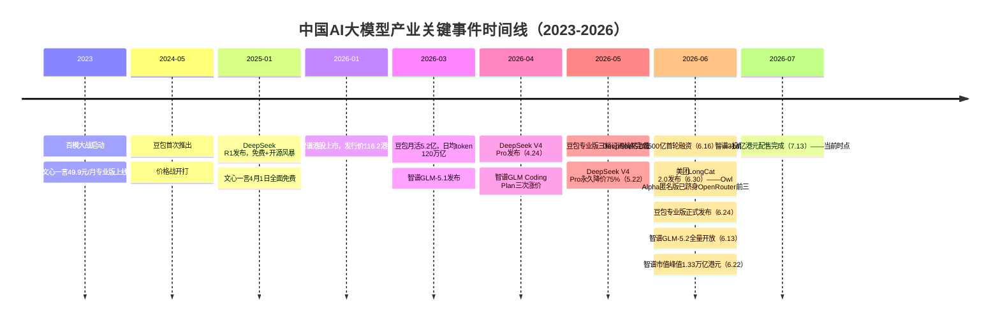
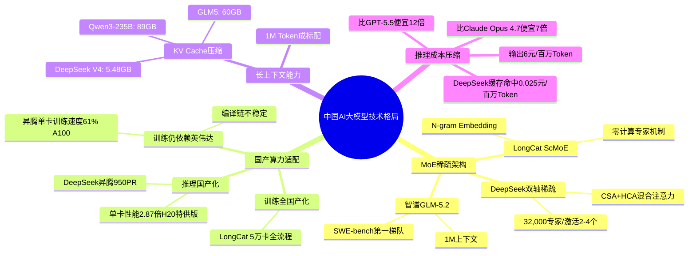
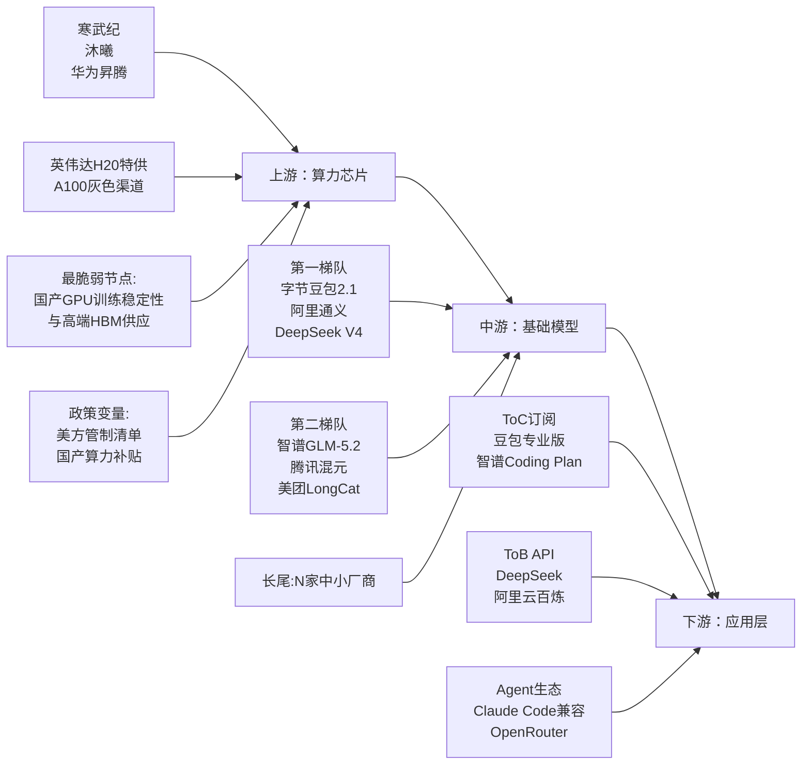
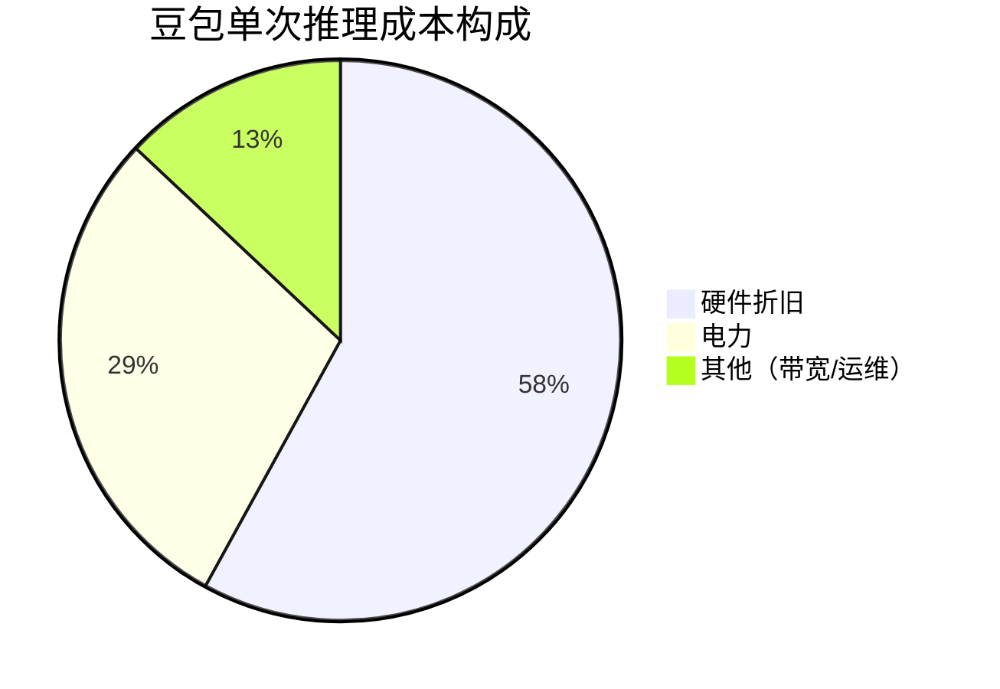
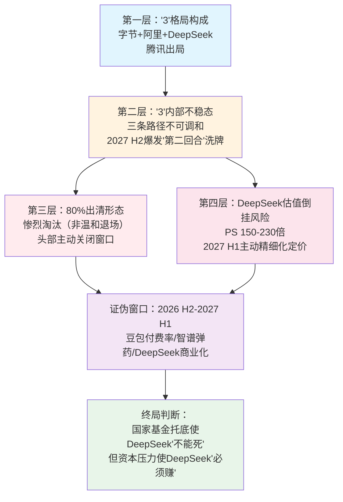
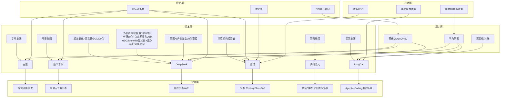
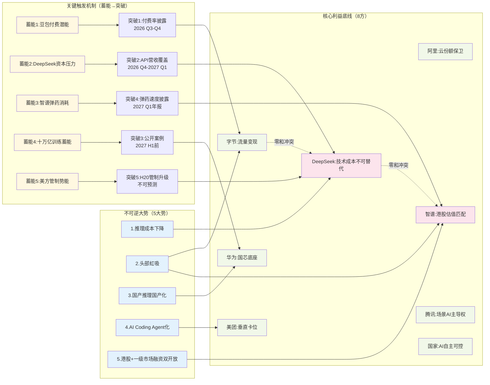
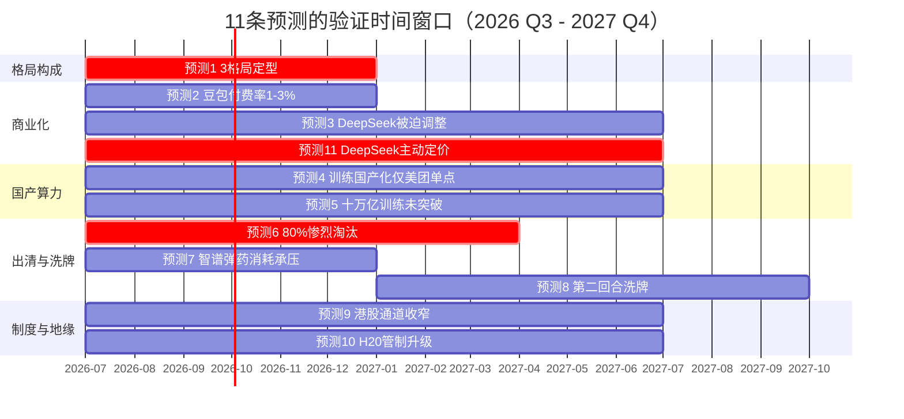
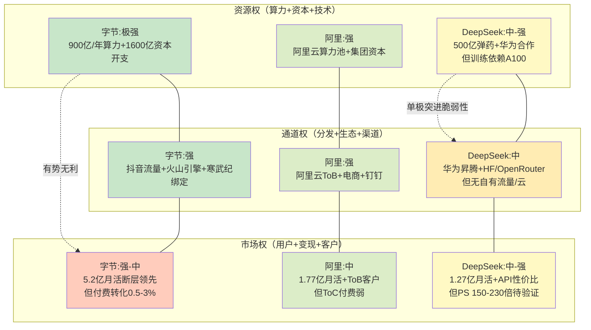

# 中国AI大模型淘汰赛——"3+N"格局定型前的最后窗口

> 分析方法：结构化战略分析框架（环境分析—利益相关方分析—趋势研判—战略推演）
> 推演窗口：2026年7月（当前）至2027年6月（证伪窗口关闭）
> 数据截止：2026年7月14日
> 数据来源：厂商官方公告、港交所披露易、技术报告、券商研报、权威媒体报道（所有数据点均附来源标注）

***

## 前置、信息收集与数据汇编

### 0. 信息收集方法论

| 信息类型   | 典型来源                                             | 可信度 | 本推演的具体来源                                                |
| ------ | ------------------------------------------------ | --- | ------------------------------------------------------- |
| 一手数据   | 厂商官方公告、港交所披露易、技术报告                               | 高   | 美团Tech Blog、DeepSeek官方定价页、智谱港交所公告（2026070900036）、字节豆包官方 |
| 行业研报   | 券商报告、咨询机构                                        | 中高  | 浙商证券（字节资本开支测算）、高盛50页研报                                  |
| 权威媒体   | 新华网、路透社、澎湃、新京报、每日经济新闻、新华财经                       | 中高  | 多方交叉验证                                                  |
| 第三方监测  | OpenCompass、BenchLM、OpenRouter、pricepertoken.com | 中   | 性能基准、价格监测                                               |
| 多方交叉验证 | 两个以上独立来源确认同一事实                                   | 最高  | 关键数据均≥2源验证                                              |

### 1. 数据底盘（按主题维度汇编）

#### 1.1 宏观全景——中国AI大模型产业总体态势

**核心规模与增长数据**：

- 豆包（字节系）：2026年3月App端+PC端月活用户5.2亿，日均token使用量突破120万亿，过去3个月翻1倍，相比2024年5月首次推出时增长1000倍【来源：火山引擎数据，转引自《新京报》2026-05-11】[6]
- 智谱：截至2026年3月，平台注册企业及用户突破400万，服务全球218个国家及地区；GLM Coding Plan全球付费开发者数量突破24.2万，Token调用量6个月涨15倍【来源：证券时报网，转引自aiproducthub.cn】[9]
- DeepSeek：V4 Pro预览版2026年4月24日发布，正式版5月22日永久降价75%，输出价格6元/百万Token【来源：DeepSeek官方定价页，路透社2026-05-23报道交叉验证】[2][11]
- DeepSeek融资与商业化指标：
  - 2026年6月16日完成首轮融资500亿元（约74亿美元），投后估值500-520亿美元，创中国AI行业单轮融资规模新纪录【来源：界面新闻2026-06-17、新浪财经2026-06-25多源验证】[17][18]
  - 投资方阵容：梁文锋个人出资200亿（40%，最大单一出资方）、腾讯100亿、宁德时代50亿、京东/网易/IDG/Monolith各30亿、正心谷/拾象各15亿、国家AI产业基金10亿（唯一享有投票权、无锁定期）【来源：myzaker 2026-06-19】[19]
  - 控制权设计：外部资金注入梁文锋担任GP的有限合伙企业，外部投资者仅享有财务收益权、无投票权、5年锁定期——"资本出钱但不掌舵"【来源：新浪财经2026-06-25】[18]
  - 营收数据（行业测算，非官方披露）：2025年全年营收约22亿元，2026 Q1营收8.5亿（同比+250%）；其中API服务占60%、企业定制30%、硬件合作10%；毛利率85-88%【来源：雪球深度研究报告2026-05-08】[21]
  - 理论利润率：2025年3月官方披露V3/R1推理系统理论日收入56.2万美元、日GPU成本8.7万美元、日盈利47.5万美元、成本利润率545%；国金证券测算推理系统理论收入利润率84.5%【来源：界面新闻2026-06-17】[17]
  - 月活1.27亿、日活1300万【来源：新浪财经2026-06-27】[20]
  - 估值与营收倒挂：3400-5200亿元估值对应22亿元年营收，PS倍数约150-230倍，市场质疑"资本一次性透支未来5年预期"【来源：新浪财经2026-06-27】[20]
- 字节资本开支：浙商证券测算2025年字节跳动资本开支约1600亿元，其中900亿用于AI算力采购，700亿用于IDC基建及网络设备，对应日均4.38亿元的投入强度【来源：浙商证券，转引自《新京报》2026-05-11】[12]

**关键拐点事件时间线**：

> **图1解读**：时间线显示2026年上半年是密集的事件窗口——4月DeepSeek V4、5月豆包订阅+DeepSeek降价、6月LongCat+智谱GLM-5.2、7月智谱配售。三个月内发生了过去三年的总和。这是"分水岭"判断的客观依据。

#### 1.2 技术赛道拆解——三大技术路线并行

**主流技术路线对比**：

| 路线 | 代表模型 | 总参数 | 激活参数 | 激活率 | 上下文 | 训练算力 | 来源 |
|---|---|---|---|---|---|---|---|
| MoE稀疏激活（国产算力） | LongCat 2.0 | 1.6T | 48B（33-56B动态） | ~3% | 1M | 5万卡国产卡全流程 | 美团Tech Blog 2026-06-30 [1] |
| MoE稀疏激活（混合算力） | DeepSeek V4 Pro | 1.6T | 490亿 | ~3.06% | 1M | 训练依赖A100，推理用昇腾 | 腾讯云社区 2026-05-14 [10] |
| MoE轻量化 | DeepSeek V4 Flash | 2840亿 | 130亿 | ~4.58% | 1M | 同上 | 同上 [10] |

**关键技术指标对比**（2026年7月时点）：

> **图2解读**：技术格局呈"四线并行"态势——MoE架构创新、国产算力适配、长上下文能力、推理成本压缩。值得注意的是：**训练全国产化（LongCat路径）与推理国产化（DeepSeek路径）是两条不同的技术路线**，前者验证"脱离海外GPU训练"可行性，后者验证"国产卡推理经济性"。两者交汇才是完整的国产化闭环，目前尚未有单一厂商同时跑通两条线。

#### 1.3 产业链结构——上游国产GPU是单一最脆弱节点

> **图3解读**：产业链最脆弱的单一节点是**上游国产GPU的训练稳定性与高端HBM供应**。LongCat已验证5万卡训练可行，但DeepSeek仍依赖A100完成训练（昇腾950PR单卡训练速度仅A100的61%，编译链不稳定）。这意味着"国产训练"目前是"美团路径"，"国产推理"是"DeepSeek路径"，两条路径尚未合一。

#### 1.4 地缘/政策/制度环境

- **美方管制**：
  - **2025-12-08**：特朗普宣布允许H200及类似产品出货至中国获批客户【来源：BIS官网2026-01-14】[27]
  - **2026-01-14/15**：BIS发布最终规则，将H200/AMD MI325X及类似芯片的许可审查政策从"默认拒绝"改为"个案审查"，但设9道严苛条件：(1)TPP<21000且总DRAM带宽<6500GB/s；(2)美市场优先保障；(3)对华出货≤对美出货50%；(4)美国本土第三方独立测试；(5)KYC与远程访问管控；(6)实体清单筛查等。**关键漏洞被堵**：内存带宽>1.5TB/s的芯片（H100/B100级）一律受限；先进封装（CoWoS/InFO/EMIB chiplet聚合）纳入管制【来源：BIS Federal Register 2026-00789、whalefactor.com 2026-07-09】[28][31]
  - **2026-02**：BIS将140家中国半导体相关企业列入实体清单，含拓荆科技、中科飞测、华海清科等设备厂商，及日本/韩国/新加坡关联企业【来源：eefocus 2026-02-14】[29]
  - **2026-05-10**：BIS再将12家中国SiC/GaN宽禁带半导体企业列入实体清单，覆盖设计/IDM/晶圆/模块全产业链【来源：qishuai-cn.com BIS公告】[30]
  - **H20特供版现状**：内存带宽约1.2TB/s，刚好低于1.5TB/s门槛，技术合规但战略上"不足以训练前沿AI模型"；配额受限【来源：whalefactor.com 2026-07-09】[31]
- **国产化政策**：国产算力补贴持续，寒武纪、沐曦等国产GPU产业链持续获得资金青睐【国家要求国央企采用国产AI芯片，部分核心行业要求100%国产，2026年国企平均80%以上将使用国产AI芯片；来源：reportify.cn 2025-11-10】[25]
- **港股融资窗口**：智谱2026年1月8日以特专科技规则上市，7月13日完成314亿港元配售，证明港股对大模型企业的融资支持力度【来源：港交所披露易2026070900036】[3]
- **备案制**：生成式AI管理办法已落地，但对头部厂商影响有限，主要约束中小厂商

#### 1.5 经济性与成本结构

**豆包单次推理成本结构**（CSDN社区报告）：

> **图4解读**：硬件折旧+电力合计占87%。这意味着**降低推理成本的根本路径是降低硬件成本**——这正是DeepSeek选择国产昇腾推理、LongCat选择全栈国产训练的经济学逻辑。MoE稀疏激活降低的是"单次推理的计算量"，国产算力降低的是"单位算力的价格"，两者乘积效应才是成本优势的来源。

**三套商业化路径的单位经济模型对比**：

| 路径 | 代表 | 单位收入 | 单位成本 | 毛利率逻辑 | 验证窗口 |
|---|---|---|---|---|---|
| ToC订阅 | 豆包专业版 | 68-500元/月/用户 | 推理成本（5.2亿月活的分摊） | 高ARPU×低转化率 | 2026 Q3-Q4财报 |
| ToC订阅（Coding） | 智谱GLM Coding Plan | 49-469元/月/用户 | 推理成本+MCP工具成本 | 中ARPU×中转化率 | 2026 H2付费用户数 |
| ToB API低价 | DeepSeek | 6元/百万Token输出 | 国产算力+MoE压缩 | 低毛利×大规模 | 2026 Q4-API调用量 |
| 免费模式 | DeepSeek（C端） | 0（生态卡位） | 全部由融资/母公司覆盖 | 无直接收入，靠生态反哺 | 不可持续，依赖输血 |

#### 1.6 风险清单

- **已知风险**：高盛50页研报由分析师Ronald Keung牵头，2026年7月发布，**原文核心判断需精确区分**：
  - **高盛实际判断**：2030年字节+DeepSeek两家将承载全行业约80%的Token消耗总量——这是"80%集中度"判断，**不是"80%出清率"判断**【来源：网易科技转引高盛报告2026-07-10、新浪财经2026-07-10、今日头条2026-07】[14]
  - **高盛四大核心问题**：(1)中国AI模型如何以低成本实现高性能；(2)为何选择开源路线及如何变现；(3)核心可寻址市场在哪里；(4)谁将成为长期赢家【来源：新浪财经2026-07-10】[14]
  - **高盛三维竞争框架**：定价能力、成本优势、财务实力；认定基础文本模型领域智谱（首次覆盖）+DeepSeek（未上市）定位最强势；多模态领域字节领跑；维持MiniMax、快手买入评级【来源：同上】[14]
  - **高盛关键预测**：中国AI模型API及订阅收入将从2026年估算的350亿元增至2030年的8790亿元（25倍增长），日均Token消耗从350万亿增至4600万亿；2030年全行业息税前利润率18%，利润池230亿美元【来源：网易科技2026-07-10】[14]
  - **本推演与高盛的关键分歧**：本推演核心论点中的"80%出清"是用户原始命题的引申，而非高盛原报告的直接判断。高盛判断的是"头部集中"（2030年80%Token消耗归头部两家），本推演进一步推演的是"中小厂商出清的形态"——后者是前者的必然推论但形态判断属本推演原创。**修正后本推演论点不变**：80%Token集中度→中小厂商被挤压→"惨烈淘汰"形态判断仍成立，但需将"高盛判断80%出清"的归因修正为"高盛判断80%Token集中，本推演据此推演中小厂商惨烈出清"。
- **数据真空风险**：豆包专业版付费转化率（字节从未官方披露，行业测算保守0.5%/中性1%/乐观3%，对应165万/330万/990万付费用户；摩根士丹利测算年订阅收入1-15亿美元；来源：东方财富2026-06-20、网易2026-05-08）[22][23]、智谱Coding Plan留存率、DeepSeek API营收（2025年22亿元营收，行业测算）——三家关键商业化指标已部分透明化但仍有空白
- **地缘黑天鹅**：美方可能出台新一轮管制，限制H20特供版甚至国产GPU上游（HBM、先进制程代工）——2026年1-5月BIS已三次升级管制（见§1.4），升级趋势明确
- **技术黑天鹅**：若MoE架构在十万亿参数规模出现训练不稳定，"算力瓶颈绕过"判断动摇
- **资本反噬风险**：智谱314亿港元配售对应市值已超8000亿港元，若营收增速不及预期，资本可能反噬；DeepSeek 500亿美元估值对应22亿营收，PS倍数150-230倍，估值与营收严重倒挂，"资本一次性透支未来5年预期"风险已现【来源：新浪财经2026-06-27】

### 2. 数据汇编小结

**最大发现**（出乎意料的数据点）：
1. **DeepSeek V4 Pro的训练仍依赖英伟达A100**，仅推理实现了昇腾国产化——这与"国产算力自主化已突破"的乐观叙事存在重要落差
2. **LongCat 2.0与DeepSeek走了两条不同的国产化路径**：美团是"训练全国产"，DeepSeek是"推理国产化+训练仍依赖海外"，两者尚未合一
3. **智谱在2026年上半年三次涨价**（2月+30%、4月+10%、4月8日+10%）——这与"价格战持续"的表面叙事相反，说明头部第二梯队已开始尝试"性能溢价"
4. **DeepSeek V4 Pro的KV Cache仅5.48GB，而GLM5为60GB、Qwen3-235B为89GB**——这是数量级差异，意味着DeepSeek的成本优势有深层技术支撑，非单纯补贴

**最大空白**（找不到数据的关键问题）：
1. 豆包专业版的付费转化率（5.2亿月活中多少转化为68元以上付费用户）
2. DeepSeek的API营收是否覆盖推理成本（"免费模式可持续"判断的核心）
3. 高盛50页研报的具体方法论与数据基础（仅有结论判断，原文未溯源）

**初步方向暗示**：
- "3+N"格局中的"3"（字节、阿里、DeepSeek）并非同质——字节是"流量+资本"型、阿里是"云+生态"型、DeepSeek是"技术+成本"型，三者的"根"不同
- 国产算力自主化是"半突破"——推理已通，训练未通，"真突破"判断需打折扣
- 80%出清更可能是"惨烈淘汰"而非"温和退场"——因为头部三家均在加速商业化卡位，中小厂商的窗口正在被主动关闭

***

## 零、核心论点

### 0.1 核心论点（一句话）

> **2026下半年至2027上半年，中国AI大模型产业将完成从"百模混战"到"3+N"格局的定型；但"3"内部并非稳态——字节、阿里、DeepSeek分别代表"流量资本型、云生态型、技术成本型"三条不可调和的路径，2027年底前将爆发第一梯队内部的"第二回合"洗牌。高盛判断的"2030年字节+DeepSeek承载全行业80%Token消耗"是头部集中度判断，本推演据此推演：80%Token集中度必然引发中小厂商"千亿资本反噬式惨烈出清"而非温和退场；同时，DeepSeek 500亿美元估值对应22亿元年营收（PS倍数150-230倍）的"估值倒挂"将成为2027年最大的资本压力点——技术成本型路径在2027 H1前必须跑通商业化闭环，否则资本反噬将从中小厂商蔓延至第一梯队。**

> **图0解读**：核心论点呈四层递进结构——第一层是"谁在局中"，第二层是"局中是否稳定"，第三层是"局外如何演化"，第四层是"局中最大风险点"。四层逻辑链最终汇聚于"证伪窗口"——2026 H2至2027 H1的6个月将是全部判断的集中验证期。

### 0.2 为什么这个论点值得被推演？

- **主流共识认为**：高盛50页研报（分析师Ronald Keung牵头，2026年7月发布）判断"中国开源大模型智能性能已逼近全球顶尖专有模型"，并预测"2030年字节+DeepSeek两家将承载全行业约80%的Token消耗总量"，对应API及订阅收入从2026年350亿元增至2030年8790亿元（25倍增长）；高盛三维竞争框架（定价能力/成本优势/财务实力）认定基础文本模型领域智谱+DeepSeek定位最强势，多模态领域字节领跑
- **我的分歧在于**：
  1. **"3"的构成**：高盛三维竞争框架认定基础文本模型领域智谱+DeepSeek定位最强势，多模态领域字节领跑——但高盛未明确将腾讯列入第一梯队，也未明确排除。本推演进一步判定"3"是字节、阿里、DeepSeek——2026年上半年腾讯混元在技术指标（无1M上下文旗舰）、商业化动作（无订阅套餐）、资本运作（无独立融资/配售）三个维度均落后于智谱，"3"不应包含腾讯
  2. **格局定型的动态性**：共识将"格局定型"视为终局，但第一梯队内部三条路径（流量资本/云生态/技术成本）的商业逻辑不可调和，2027年将进入"第二回合"内部洗牌——智谱与DeepSeek的"根"直接零和（智谱晋级=DeepSeek失去核心利益底线）
  3. **出清形态判断**（本推演原创推演，非高盛原文）：高盛判断的是"80%Token集中度"，但80%集中度必然意味着中小厂商被挤压至边缘——本推演进一步推演其形态为"惨烈淘汰"而非"温和退场"，因为头部三家正在主动关闭中小厂商生存窗口（DeepSeek免费+低价、豆包5.2亿月活虹吸、智谱涨价+配售弹药）
  4. **新增分歧——DeepSeek估值倒挂风险**：高盛维持对DeepSeek的强势定位，但本推演认为DeepSeek 500亿美元估值对应22亿元年营收（PS倍数150-230倍）存在严重估值倒挂——若2027 H1商业化闭环未跑通，资本反噬将从中小厂商蔓延至第一梯队，DeepSeek可能被迫加速商业化转型（推出付费档/限制免费额度/企业级增值服务），这将动摇"免费模式"叙事
- **如果我是对的，什么会改变？**
  1. 投资者对"第二梯队"（智谱、腾讯、美团、Kimi）的估值逻辑需重估——不是所有"第一梯队候选"都能晋级；同时DeepSeek 500亿美元估值需接受"营收验证窗口"考验
  2. "国产算力自主化"叙事需分层定价——"推理国产化"已通，"训练国产化"仅美团单点突破，"全栈国产化"尚未实现；中芯N+2产线缺口160万颗/年是硬约束
  3. 中小厂商的退出路径不是"被并购"而是"资本归零"——这影响一级市场退出预期；同时DeepSeek的"资本出钱但不掌舵"架构（5年锁定期+LP隔离+国家基金特殊地位）若被验证为可持续，将成为未来AI创业公司治理范式
  4. 国家AI产业基金10亿直投DeepSeek主体（唯一享有投票权、无锁定期）——这意味着DeepSeek已正式跻身国家级AI战略布局核心载体，其"失败"不再是商业失败而是战略级事件，国家层面有动机托底

### 0.3 本推演回答什么关键问题？

- **问题1**：第一梯队（字节、阿里、DeepSeek）中，谁的商业模式最可持续？豆包的"订阅付费"还是DeepSeek的"API低价+ToB"？
- **问题2**：国产算力自主化是"真突破"还是"阶段性替代"——能训练万亿模型，但能训练十万亿模型吗？
- **问题3**：高盛判断的"80%Token集中度"将如何演化为中小厂商出清形态——是"一堆小公司死掉"的温和出清，还是"烧掉千亿资本后只剩3家"的惨烈淘汰？
- **问题4（新增）**：DeepSeek 500亿美元估值与22亿元年营收的"估值倒挂"是否会引发资本反噬？国家AI产业基金的战略托底能否化解这一风险？

***

## 一、环境与结构分析（产业格局）

> 追问：当下"地"之三个维度如何？此步只描摹客观格局，不下价值判断、不揣测人心。
> 重点关注：哪个维度强、哪个维度弱、哪个维度正在变化？变化的方向是什么？

### 1.1 版图（地理/资源/人口/产业链分布）

**空间边界与资源禀赋**：

中国AI大模型产业的"版图"不是地理版图，而是**算力版图+用户版图+资本版图**的三重叠合。

- **算力版图**：呈现"三圈层"结构
  - 核心圈：字节（自建集群，900亿/年资本开支）、阿里（阿里云算力池）、DeepSeek（华为昇腾深度适配+部分A100）——三家拥有万卡级稳定训练集群
  - 次核心圈：智谱（314亿港元弹药+华为合作）、腾讯（云算力池）、美团（5万卡国产集群，但为单一模型服务）——具备规模化训练能力
  - 边缘圈：Kimi、MiniMax、百度、网易、快手等——千卡级，依赖云计算租赁

- **用户版图**：豆包断层领先，但"用户数≠付费能力"
  - 豆包5.2亿月活（App+PC），超过千问（1.77亿）、DeepSeek（1.6亿，2026.3新京报数据；另有新浪财经2026.6报道1.27亿月活+1300万日活，口径差异待考）、元宝（7856万）、Kimi（2970万）之和【来源：新京报2026-05-11】[6]
  - 但25人抽样调查中20人明确"不会付费"，仅2人乐意付费、3人观望【来源：新京报AI研究院抽样】[6]
  - 这意味着豆包的"用户版图"是"流量版图"而非"收入版图"——5.2亿月活的商业化转化率是核心未知数

- **资本版图**：智谱配售后，第一梯队资本弹药重排
  - 字节：2025年1600亿资本开支，2026年预计持续高强度
  - 智谱：314亿港元（约290亿人民币）配售弹药，计划2027年底前用完
  - DeepSeek：2026年6月完成500亿首轮融资（投后估值500-520亿美元），投资方包括梁文锋个人200亿、腾讯100亿、宁德时代50亿、京东/网易/IDG/Monolith各30亿、国家AI产业基金10亿；详见§1.3股权结构表
  - 阿里：阿里云算力+集团资本，具体AI投入未单独披露

**人口结构与产业链地理分布**：

产业"人口"主要是**开发者生态**——这是大模型产业的真正"人口结构"。

- 智谱GLM Coding Plan：全球付费开发者24.2万，Token调用量6个月涨15倍【来源：证券时报网】
- DeepSeek：Reddit案例显示独立开发者跑24/7 Agent系统4周消耗1亿Token，账单仅280美元【来源：smzdm.com.cn引Reddit】
- LongCat 2.0：预览版已跻身OpenRouter全球调用量前三，与Claude Code、OpenClaw并列【来源：美团Tech Blog 2026-06-30】

**关键变量**（注册至§六 数据-推演映射表）：
- 变量A：豆包月活→付费转化率（决定ToC订阅路径是否成立）
- 变量B：DeepSeek API营收/推理成本比（决定免费+低价路径是否可持续）
- 变量C：国产GPU训练稳定性（决定"训练全栈国产化"能否从美团单点扩展为行业能力）

### 1.2 制度（规则/产权/法律/隐性礼俗）

**显性规则**：

- **备案制**：生成式AI服务需向网信办备案，对头部厂商是合规成本，对中小厂商是准入门槛
- **港股特专科技规则**：智谱以该规则上市，为大模型企业打开港股融资通道——这是制度层面的重要变量，意味着大模型企业可以"未盈利上市"
- **美方出口管制**：BIS管制清单限制高端GPU对华出口，H20特供版是当前合规通道，但配额受限

**隐性规则**（行业惯例、政治默契）：

- **"免费为王"默契正在瓦解**：2025年4月文心一言被迫全面免费，是因为DeepSeek R1的免费+开源冲击；但2026年5月豆包专业版上线标志着头部厂商重新尝试收费——"免费"不再是不可触碰的禁忌
- **"不开源即落后"压力**：DeepSeek MIT开源、LongCat全面开源、智谱GLM部分开源——开源已成为头部厂商的"合法性证明"，不开源的厂商面临开发者流失压力
- **"国资+民企"分工默契**：华为（昇腾芯片）+美团/DeepSeek（模型算法）形成"国芯民模"分工，这是规避美方制裁的隐性制度安排

**制度变迁的方向与速度**：

- 港股融资通道：已开（智谱先行），后续厂商可复制——速度中
- 国产算力补贴：持续，但向头部集中——速度中
- 美方管制：方向是收紧（H20可能被进一步限制），速度取决于中美关系——速度不可预测

**关键变量**：
- 变量D：港股融资通道是否对第二梯队开放（决定中小厂商是否有"输血"渠道）
- 变量E：美方H20管制是否升级（决定DeepSeek训练算力供给）

### 1.3 产业（技术/装备/基建/资本存量）

**技术水平与成熟度曲线**：

按Gartner成熟度曲线映射中国大模型产业关键技术：

| 技术 | 成熟度 | 验证标志 | 瓶颈 |
|---|---|---|---|
| MoE稀疏激活 | 规模化 | DeepSeek V4 Pro 3.06%激活率 | 十万亿规模稳定性未验证 |
| 国产算力训练 | 小批量→规模化 | LongCat 5万卡全流程 | 仅美团单点突破，行业可复现性未证 |
| 国产算力推理 | 规模化 | DeepSeek昇腾950PR推理性能2.87倍H20 | 训练仍依赖海外 |
| 长上下文（1M） | 规模化 | DeepSeek/LongCat/智谱均支持 | KV Cache压缩技术差异大 |
| Agent Coding | 实验室→小批量 | LongCat/DeepSeek V4 Pro已验证 | 商业化场景仍在探索 |
| 国产GPU训练十万亿模型 | 实验室前 | 无公开案例 | 寒武纪/沐曦单卡性能不足 |

**装备存量与产能利用率**：

- 字节：自建GPU集群，2025年AI算力采购900亿元——产能利用率高（豆包日均120万亿token）
- 美团：5万卡国产集群，LongCat训练已用——但训练完成后是否闲置？是否对外服务？`[LongCat 2.0通过longcat.ai和OpenRouter对外服务，预览版（Owl Alpha）匿名测试期2个月月调用量达10.1万亿token、日处理559B token、环比增长242%，在Hermes场景月调用全球第一、Claude Code场景全球第二（仅次于Claude Opus 4.8）；API定价0.30美元/百万token vs GPT-5.5的2.50美元；来源：VentureBeat转引自美团Tech Blog 2026-06-30]`[1][32]
- 国产GPU产能：
  - 华为昇腾：2025年出货约80万片，2026年预计增长70%；950系列预计2026 H2量产，引入CIMET架构提升CUDA兼容性【来源：钛媒体APP 2026-07-05】[24]
  - 寒武纪：2025年前三季度出货15万片（90%以上供应字节），2026年目标30-40万片（增长100%+）；思元590性能约A100的70%，思元690（2026量产）FP16 >700 TFLOPS配HBM3；客户结构从政企转向商业客户（字节/阿里/腾讯/百度占比从2024年15%升至2026 Q1的55%）【来源：reportify.cn 2025-11-10行业调研、A研报2026-07-06】[25]
  - 沐曦：2025年4-5万片，2026年出货量和营收均将翻倍；MXC600芯片首次实现全国产工艺（设计-制造-封装-软件栈全国产供应链），通过国家信息安全测评中心认证；下一代C700目标对标H100【来源：reportify.cn 2025-11-10行业调研；注：快科技2026-07-08曾报道"订单排满"但7月9日沐曦官方已辟谣，本报告不采用该说法，产能数据以来源25为准】[25][26]
  - 中芯N+2（等效7nm）产线：2026年底月产能7万片，全年约260万颗AI芯片——但全行业需求约420万颗，缺口160万颗；7nm/12nm工艺产能仅能满足一半需求【来源：钛媒体APP 2026-07-05】[24]
  - 整体国产AI芯片供需：2026年市场需求至少400万片，国产芯片需供应300多万片，其中华为可能占据150万片（43%份额），寒武纪约11%份额【来源：钛媒体APP 2026-07-05】[24]
  - 互联网巨头国产化率：2026年字节和阿里国产芯片采购占比预计超过50%，腾讯约30%【来源：reportify.cn 2025-11-10】[25]

**基础设施与可调用资本量**：

- 字节：1600亿/年资本开支（2025年），2026年预计持续
- 智谱：314亿港元配售弹药（2027年底前用完）
- 阿里：阿里云基础设施+集团资本，具体AI投入未披露
- DeepSeek：**2026年6月16日完成首轮融资500亿元（约74亿美元），投后估值500-520亿美元**【来源：界面新闻2026-06-17、myzaker 2026-06-19、新浪财经2026-06-25多源验证】

**DeepSeek 500亿融资股权结构明细表**（2026-07-15整理·部分细节仍待考）：

| 投资方 | 出资金额（亿元） | 占比 | 投资性质 | 投票权 | 锁定期 | 战略意图 |
|---|---|---|---|---|---|---|
| 梁文锋（创始人个人） | 200 | 40% | 最大单一出资方 | 有（通过GP架构） | 无（创始人） | 牢牢锁定控制权，"技术主导而非资本主导"；资金来源为幻方量化2025年56.55%收益率、86亿年收费的分红 |
| 腾讯 | 100 | 20% | 最大外部投资者 | 无 | 5年 | "自研底座（混元）+外部生态投资（DeepSeek）"双轨AI战略落地；弥补通用大模型短板 |
| 宁德时代体系（含溥泉资本） | 50 | 10% | 产业资本 | 无 | 5年 | 卡位AI数据中心储能与HVDC供电市场（"AI尽头是能源"逻辑） |
| 京东 | 30 | 6% | 产业资本 | 无 | 5年 | 电商物流场景AI改造（智能客服、供应链预测、仓储调度） |
| 网易 | 30 | 6% | 产业资本 | 无 | 5年 | 游戏数字内容场景AI改造（剧情生成、虚拟数字人、内容审核） |
| IDG资本 | 30 | 6% | 财务资本 | 无 | 5年 | 纯财务投资，看重技术迭代速度 |
| Monolith砺思资本 | 30 | 6% | 财务资本 | 无 | 5年 | 纯财务投资 |
| 正心谷投资 | 15 | 3% | 财务资本 | 无 | 5年 | 纯财务投资 |
| 拾象科技 | 15 | 3% | 财务资本 | 无 | 5年 | 纯财务投资 |
| **国家人工智能产业投资基金** | 10 | 2% | **国家战略资本** | **有**（唯一例外） | **无锁定期** | 唯一直接注资DeepSeek主体、享有投票权的投资方——标志DeepSeek正式跻身国家级AI战略布局核心载体 |
| **合计** | **500** | **100%** | — | — | — | — |

**控制权架构要点**（"三重保险"）：
1. **LP架构隔离**：除国家AI产业基金外，所有外部投资者资金注入梁文锋担任GP的有限合伙企业，再由该企业向DeepSeek增资——外部投资者仅享有财务收益权
2. **投票权集中**：梁文锋融资前直接+间接控制约84%股权、接近100%表决权；融资后通过GP架构仍握绝对控制权
3. **5年锁定期**：所有外部投资方股权5年内不得转让，过滤追求短期回报的资本
4. **国家基金特殊地位**：唯一注资主体、唯一享有投票权、无锁定期——体现国家战略资本的特殊位置
5. **阿里缺席**：阿里巴巴因要求"相当比例股权+董事会决策权"与梁文锋控制权坚持冲突，最终未进入股东名单【来源：财闻报道】

**关键变量**：
- 变量F：国产GPU训练十万亿模型的公开案例出现时点（决定"真突破"vs"阶段性替代"判定）
- 变量G：头部三家的资本可持续性（字节烧钱速度、智谱弹药耗尽时点、DeepSeek 500亿弹药消耗节奏+估值倒挂压力）

### 1.4 三维度交叉判断（强制）

| 维度 | 强弱判定 | 支撑证据 | 变化方向 |
|---|---|---|---|
| 版图 | **中-强** | 豆包5.2亿月活断层领先；智谱24.2万付费开发者；但DeepSeek/阿里用户数据不透明 | ↑ 用户端继续向头部集中 |
| 制度 | **中** | 港股融资通道已开（智谱验证）；但美方管制收紧是单向趋势；备案制对中小厂商是门槛 | → 国内制度稳，地缘制度紧 |
| 产业 | **中-弱** | MoE推理成熟，但训练国产化仅美团单点；十万亿训练未验证；国产GPU单卡性能仍落后 | ↑ 但速度慢于预期 |

> **三个维度失衡分析**：**产业（弱）<版图（中-强）** 是核心失衡。版图端用户和资本正在加速向头部集中，但产业端"训练全栈国产化"和"十万亿模型"两个关键能力尚未突破。这意味着——**当前的"3+N"格局是建立在"推理国产化+部分训练国产化"的半突破之上的，若美方管制升级切断A100训练通道，或十万亿模型训练失败，整个格局将被迫重构**。这是本推演最重要的"失衡破局点"。

***

## 二、利益相关方分析（参与者画像）

> 追问：局中各方"人"如何？此步只刻画结构位置与驱动力，不预设道德。
> 本节不只分析"谁是谁"，而是画出利益网络——谁的利益被谁影响、态度如何、有多大力量推动或阻碍。

### 2.1 立场（轨道）

立场 = 决策权限 × 资源禀赋 × 信息视野。

**主要参与方及其立场**：

| 参与方 | 决策权限 | 资源禀赋 | 信息视野 | 立场标签 |
|---|---|---|---|---|
| 字节（豆包） | 极高（集团战略级） | 极强（1600亿/年资本开支+5.2亿月活+抖音流量） | 极广（ToC+ToB+全球化） | **流量资本型巨头** |
| 阿里（通义/千问） | 高（云业务战略级） | 强（阿里云算力池+电商生态+集团资本） | 广（ToB为主+云客户全景） | **云生态型巨头** |
| DeepSeek | 中-高（独立公司+500亿外部弹药+产业资本联盟） | 中-强（技术领先+华为合作+500亿融资弹药+腾讯/宁德/京东/网易产业协同） | 中（聚焦技术，ToB+开发者） | **技术成本型挑战者** |
| 智谱 | 中（独立公司+港股上市） | 中-强（314亿港元弹药+清华背景+华为合作） | 广（ToB+ToC开发者+全球） | **资本弹药型追赶者** |
| 腾讯（混元） | 中（云业务+集团支持） | 强（云算力+微信生态+集团资本） | 中（ToB+游戏/社交场景） | **场景依附型巨头** |
| 美团（LongCat） | 低（非核心战略业务） | 中（5万卡国产集群+技术团队） | 窄（聚焦Agentic Coding） | **垂直突围型边缘玩家** |
| 中小厂商（Kimi/MiniMax/百度等） | 低 | 弱 | 窄 | **生存型边缘参与方** |
| 华为（昇腾） | 高（芯片+算力底座） | 极强（芯片产能+国产化政策红利） | 广（赋能所有国产化玩家） | **国芯底座型幕后博弈方** |
| 国家（监管/政策） | 极高 | 极强（补贴+准入+地缘） | 极广 | **战略平衡型元博弈方** |

> **立场标签价值**：这些标签是后续推演中反复调用的"身份锚"。同一立场可换人——若DeepSeek倒下，技术成本型挑战者的位置会被另一个独立公司填补；不同立场不可换同质人——字节无法替代DeepSeek的技术成本型角色，因为其立场（流量资本型）决定了它必须用资本和流量打仗，而非用极致技术成本。

### 2.2 诉求分层分析（恐惧 / 声明 / 隐秘渴望）——各参与方驱动力解剖

| 参与方 | 恐惧（可能失去之物） | 声明（公开宣称的目标） | 隐秘渴望（真实意图） | 言行分歧度 |
|---|---|---|---|---|
| 字节（豆包） | 抖音增长见顶后无第二增长曲线；AI投入900亿/年无法回收 | "让AI服务每一个人"（公开口号） | 成为AI时代的"操作系统"，把5.2亿月活转化为下一个抖音级变现机器 | **中**（声明与意图方向一致，但路径模糊） |
| 阿里（通义） | 阿里云增速放缓被腾讯云/华为云超越；电商基本盘被拼多多侵蚀 | "让算力像水电一样普惠"（云战略口号） | 用AI重新锁定企业客户，扭转阿里云市场份额下滑，重建生态壁垒 | **高**（"普惠"口号vs"锁定"私欲分裂明显） |
| DeepSeek | 500亿美元估值与22亿年营收严重倒挂（PS 150-230倍），若商业化未达预期资本将反噬；500亿弹药消耗速度过快触发外部投资者（腾讯/宁德/京东等）施压"精细化定价"；A100训练通道被美方管制切断；核心人才流失（2025 H2至今至少5名核心研发离职，覆盖基座/推理/OCR/多模态四条线）；技术成本优势被智谱/字节追平 | "开源 democratize AI"（技术理想主义），成为AI界台积电——不可替代的底座 | 用极致成本优势逼迫所有竞品退出通用大模型赛道，成为"AI界台积电"——不可替代的底座 | **低**（声明与意图高度重合，技术理想主义即私欲） |
| 智谱 | 314亿港元弹药用完前无法跑通商业化；港股估值泡沫破裂 | "Touch High摸高计划"——挑战AGI技术高地（唐杰内部信） | 用配售弹药熬死第二梯队其他玩家，晋级第一梯队，估值对标OpenAI | **高**（"不追短期变现"的愿vs"熬死对手晋级"的欲严重分裂） |
| 腾讯（混元） | 字节豆包5.2亿月活虹吸微信生态；AI落后导致游戏/社交场景被颠覆 | "AI助力产业互联网"（保守表态） | 不在通用大模型上硬刚字节，但守住游戏/社交/企业微信的AI化场景，做"场景AI霸主" | **低**（声明与意图一致——保守防守） |
| 美团（LongCat） | LongCat投入无法回收；Agentic Coding赛道被DeepSeek/字节碾压 | "盘活存量国产算力，释放国产算力生态价值"（Tech Blog表态） | 验证美团技术能力，为未来AI+本地生活场景卡位，但不与头部硬刚 | **低**（声明与意图一致——卡位不争霸） |
| 中小厂商 | 资金链断裂；被头部免费模式挤压；被资本抛弃 | 各家口号不一（"专注垂类"/"差异化竞争"） | 活下来，被收购退出，或转型服务 | **高**（"差异化"愿vs"被收购退出"欲分裂） |
| 华为（昇腾） | 国产GPU被美方上游（HBM/代工）卡死；昇腾生态被英伟达反扑 | "构建中国AI算力底座"（公开战略） | 用昇腾+鸿蒙+盘古构建"去美化"技术栈，成为中美脱钩时代的"基础设施霸主" | **低**（声明与意图一致——基础设施霸权） |
| 国家 | AI产业被美国彻底甩开；国产算力自主化失败；数据/算力主权丧失 | "AI强国战略""新质生产力"（政策话语） | 在AI领域建立"自主可控+全球竞争力"的双重能力，AI成为中美博弈核心战场 | **低**（声明与意图一致——战略自主） |

> **言行分歧度判读**：
> - **分裂度最高的是智谱和阿里**——智谱宣称"不追短期变现"却急于配售314亿港元弹药；阿里宣称"普惠"却想用AI锁定客户。分裂处即破绽：智谱的"摸高计划"在资本市场压力下可能被迫转向商业化加速；阿里的"普惠"在云业务份额压力下可能转向封闭生态。
> - **分裂度最低的是DeepSeek和华为**——DeepSeek的技术理想主义即其私欲（成为不可替代底座），华为的基础设施霸权即其公开战略。这种"声明与意图合一"使两者行为高度可预测，也使其成为最值得信任的博弈方。
> - **字节居中**——声明与意图方向一致（都想成为AI霸主），但路径模糊（订阅？广告？生态？），这种模糊性是字节最大的不确定性。

### 2.3 利益网络分析

**以DeepSeek（技术成本型挑战者）为锚点，分析其立场影响了谁的什么利益**：

#### A. 直接受益方（利益被促进的力度越大，支持越坚定）

| 受益方 | 受益内容 | 促进力度 | 态度与情绪 | 支持方式 |
|---|---|---|---|---|
| 独立开发者/中小Agent团队 | API成本从GPT-5.5的$75/M Token降至$3.48/M Token，降幅95% | **大** | 极度拥护 | Reddit口碑传播、OpenRouter调用量虹吸、HuggingFace生态绑定 |
| 华为（昇腾） | DeepSeek验证昇腾950PR推理性能（2.87倍H20），打开国产推理商业化通道 | **大** | 战略协同 | 芯片供应优先、联合研发、生态背书 |
| 国家（监管/政策） | DeepSeek MIT开源+国产适配+国家AI产业基金10亿直投（唯一享有投票权），符合"自主可控"战略 | **大** | 默许支持→**已升级为战略投资** | 国家AI产业基金直接注资DeepSeek主体（无锁定期+投票权）、算力补贴、备案绿色通道 |
| 腾讯（投资方） | 100亿入股DeepSeek，弥补自研混元在通用大模型上的短板，"自研底座+外部生态投资"双轨AI战略落地 | **大** | 战略协同 | 100亿出资+应用层互补（腾讯元宝接入DeepSeek API） |
| 宁德时代（投资方） | 50亿入股，卡位AI数据中心储能与HVDC供电市场（黄仁勋"AI工厂"逻辑：AI尽头是能源） | **中-大** | 战略卡位 | 50亿出资+数据中心储能合作 |
| 京东/网易（投资方） | 各30亿入股，获取电商物流/游戏内容场景的AI改造能力 | **中** | 产业协同 | 30亿出资+垂直场景反向推动模型适配 |
| 中小AI应用厂商 | DeepSeek低价API使其可基于底座模型做应用，无需自训模型 | **中** | 依赖但警惕 | 调用量增长，但担心被DeepSeek反向挤压 |

#### B. 直接受损方（利益被损害的程度越深，反制越激烈）

| 受损方 | 受损内容 | 损害程度 | 态度与情绪 | 反制能力 |
|---|---|---|---|---|
| OpenAI/Anthropic/Google | 全球定价体系被DeepSeek重写，高端模型溢价被压缩 | **大** | 警惕但短期反制有限 | 路透社报道已关注，但缺乏直接反制手段；可能通过美方管制施压 |
| 国内中小模型厂商 | DeepSeek免费+低价直接挤压生存空间，"差异化"叙事失效 | **极大** | 恐慌但反制能力弱 | 转型垂类、被收购、倒闭；无直接反制DeepSeek的能力 |
| 字节（豆包） | DeepSeek免费模式挤压豆包付费转化空间，5.2亿月活难以变现 | **中** | 高度警惕 | 用流量+资本碾压（豆包专业版订阅、Agent能力差异化） |
| 英伟达（间接） | 国产算力推理验证成功，H20特供版性价比被削弱 | **中** | 商业利益受损 | 通过美方管制维护高端GPU垄断 |

#### C. 间接受益方

| 受益方 | 受益内容 | 态度 | 可争取性 |
|---|---|---|---|
| 港股投资者 | DeepSeek验证国产大模型技术路径，重估智谱等标的 | 拥护 | 已通过智谱配售体现 |
| 国产GPU产业链（寒武纪/沐曦） | LongCat+DeepSeek验证国产算力商业化可行性，资金青睐 | 拥护 | 资本市场已反映 |
| 中国AI应用层厂商 | 底座模型成本下降，应用层利润空间打开 | 中立偏积极 | 视具体场景而定 |

#### D. 间接受损方

| 受损方 | 受损内容 | 态度 | 联合反制风险 |
|---|---|---|---|
| 美方半导体管制体系 | "管制即可遏制"逻辑被DeepSeek/LongCat突破 | 战略焦虑 | 可能升级管制（HBM/代工/软件） |
| 传统软件厂商 | AI Coding Agent冲击传统软件外包/IT服务模式 | 抵抗 | 转型或游说监管 |

#### E. 无直接利益相关方

| 方 | 态度 | 可争取性 | 争取条件 |
|---|---|---|---|
| 欧洲监管机构 | 中立 | 可争取 | 数据合规、GDPR配合 |
| 东南亚/中东开发者 | 中立偏积极 | 可争取 | 本地化部署、价格优势 |

> **利益网络判读**：DeepSeek的"安全系数"=受益方力量（独立开发者+华为+国家+腾讯+宁德+京东+网易，七方联盟）vs受损方力量（OpenAI/中小厂商/字节/英伟达，分散且反制能力弱）。**比值显著倾向DeepSeek且较初版判断进一步加强**——2026年6月500亿融资完成后，DeepSeek已从"结构性可持续"升级为"资本+产业+国家三方背书的战略级存在"。这意味着DeepSeek的"免费+低价+国产化"路径在结构上**高度可持续**，因其触动了"国家自主可控+华为基础设施+开发者生态+产业资本联盟"四方根本利益的重合。需注意：500亿美元估值对应22亿年营收的PS倍数150-230倍，若商业化未达预期，资本可能反噬——这是DeepSeek的新增风险点。

### 2.4 企业/组织网络

> **图5解读——枢纽节点识别**：
> 1. **华为昇腾是最大的跨网络枢纽**——同时连接DeepSeek、智谱、美团三家第一/第二梯队玩家，是"国芯民模"分工的核心节点。华为的态度决定国产化路径的开放度。
> 2. **字节是资本层最强势的孤立节点**——业务层只连接抖音流量分发，算力层主要依赖英伟达（虽也在推进国产化但未深度绑定），技术层无外部学术合作。这种"孤立"既是优势（自主可控），也是劣势（缺乏生态协同）。
> 3. **智谱是网络嵌入度最高的节点**——资本层（港股）、算力层（华为）、权力层（港交所+网信办）、技术层（清华KEG）四层全覆盖，但这种"全覆盖"也意味着其立场最易被任一层级牵制。
> 4. **DeepSeek的关键弱连接**——技术层无学术合作节点（独立研发），资本层仅幻方单一来源，这种"轻资产+轻网络"结构使其灵活性高但抗风险能力弱（若幻方撤资或华为芯片断供，立即崩塌）。

### 2.5 利益相关方分析小结

- **谁的"愿"与"欲"分裂最大？** 智谱（"不追短期变现"vs"配售314亿港元熬死对手"）和阿里（"普惠"vs"锁定客户"）。分裂处即破绽——智谱的"摸高计划"在2027年底弹药用完前必须转向商业化验证，否则资本市场反噬；阿里的"普惠"在云份额压力下可能转向封闭生态，与开源社区形成张力。
- **谁的利益网络中"受损方力量"大于"受益方力量"？** 中小模型厂商——受损方（DeepSeek免费+字节虹吸+智谱涨价挤压）力量极大，受益方（垂类客户）支持力度小且分散。其立场不可持续，80%出清是结构性必然。
- **谁是跨网络枢纽？** 华为昇腾——同时赋能DeepSeek、智谱、美团，是"国芯民模"分工的核心。华为的战略选择（是否对所有玩家开放昇腾生态、是否推进全栈国产化训练）将决定整个产业的国产化进程。

***

## 三、趋势与时机研判（趋势研判）

> 追问："势"之三向如何？此步判读趋势走向与触发时机。
> 分析顺序：先识别大势 → 再判断触发时机 → 最后确认各方核心利益底线。

### 3.1 不可逆大势（必然趋势）——不可逆的洪流

| 大势 | 驱动力 | 不可逆程度 | 对核心论点的影响 |
|---|---|---|---|
| 1. 推理成本指数级下降 | MoE稀疏激活+国产算力+KV Cache压缩三重叠加，DeepSeek已将输出价格压至6元/百万Token | **高**（技术驱动，不可逆） | 直接支撑"中小厂商出清"——成本战已无法回头 |
| 2. 头部三家用户/资本/算力虹吸 | 豆包5.2亿月活+字节900亿/年算力+智谱314亿港元+DeepSeek技术领先，三家占尽资源 | **高**（结构性，不可逆） | 直接支撑"3+N格局定型"——中小厂商无资源可争 |
| 3. 国产算力推理国产化 | DeepSeek昇腾950PR推理性能2.87倍H20，已规模化验证 | **高**（技术驱动，不可逆） | 支撑"国产化半突破"判断——推理已通 |
| 4. AI Coding Agent化 | LongCat/DeepSeek V4 Pro均聚焦Agentic Coding，OpenRouter调用量前三 | **中-高**（技术+需求双驱动） | 改变商业化路径——从"对话付费"转向"生产力付费" |
| 5. 港股融资通道+一级市场AI融资双开放 | 智谱以特专科技规则上市+314亿港元配售成功（港股通道验证）；DeepSeek 2026.6完成500亿一级市场融资（一级市场通道验证，投后估值500亿美元） | **中**（制度驱动，可逆） | 为第二梯队提供输血渠道，但门槛极高；DeepSeek一级市场融资成功依赖其"技术理想主义+国家战略"叙事，第二梯队难以复制 |

> **不可逆程度判断说明**：技术驱动的趋势（推理成本下降、国产推理国产化、Agent化）不可逆程度高，因其由成本曲线和技术扩散决定；制度驱动的趋势（港股融资通道）不可逆程度中，因其可被政策调整逆转；用户/资本虹吸是不可逆的"赢家通吃"效应，但具体赢家可能更替。

### 3.2 关键触发机制（触发关键）——趋势蓄能区与突破触发点

#### 趋势蓄能区（力之积蓄——"有兵不能战"）

| 蓄能内容 | 蓄能程度 | 释放的条件 | 当前阻塞原因 |
|---|---|---|---|
| 1. 豆包5.2亿月活的付费转化潜能 | 极高（新京报抽样25人中5人愿意/观望，按1%转化=520万付费用户×68元=3.5亿/月） | 付费功能差异化足够（Agent能力、Office集成） | 用户对"AI付费"心智未建立；25人中20人明确不付费 |
| 2. DeepSeek免费模式的资本回报压力 | 极高（500亿美元估值对应22亿年营收，PS倍数150-230倍；500亿弹药消耗速度+外部投资者5年锁定期满后的退出压力；理论成本利润率545%但实际营收增速需匹配估值预期） | 2026全年营收增速>300%且API营收覆盖推理成本；或2027 H1前主动推出付费档/增值服务缓解资本回报压力 | 500亿弹药消耗速度过快（>50%/年）+营收增速持续<200%触发外部投资者施压；A100训练通道被切断导致技术迭代受阻 |
| 3. 智谱314亿港元的弹药消耗 | 高（计划2027年底前用完，对应约290亿人民币/18个月≈16亿/月） | 营收增速匹配弹药消耗速度 | 2026 H2商业化指标（Coding Plan付费用户数、ToB合同）尚未披露 |
| 4. 国产GPU训练十万亿模型的技术蓄能 | 中（LongCat已验证5万卡训练1.6T，但十万亿需50万卡级集群） | 寒武纪/沐曦产能突破+训练稳定性攻克 | 单卡性能不足（昇腾训练速度仅A100的61%）+编译链不稳定 |
| 5. 美方管制升级的势能 | 高（BIS已多次升级，HBM/代工/软件均可能被限制） | 中美关系恶化触发新一轮管制 | 短期内美方也在评估DeepSeek/LongCat突破的实际影响 |

#### 突破触发点（力之出口——"新器之萌芽"与"旧序之裂痕"）

| 突破内容 | 触发时间估计 | 触发后的连锁反应 | 置信度 |
|---|---|---|---|
| 1. 豆包专业版付费转化率首次披露 | 2026 Q3-Q4字节财报 | 若转化率>2%，验证ToC订阅路径；若<0.5%，豆包商业化失败 | **高**（字节财报必然披露） |
| 2. DeepSeek API营收覆盖推理成本的里程碑 | 2026 Q4-2027 Q1 | 若覆盖，免费模式可持续；若未覆盖，500亿弹药消耗压力+估值倒挂资本反噬风险暴露 | **中**（DeepSeek未上市，披露自主性高） |
| 3. 国产GPU训练十万亿模型的首次公开案例 | 2027 H1前 | 若出现，"真突破"判定成立；若无，"阶段性替代"判定成立 | **中**（取决于寒武纪/华为进度） |
| 4. 智谱314亿港元弹药消耗速度首次披露 | 2026年报（2027 Q1发布） | 若消耗过半且营收未起，资本市场反噬；若营收匹配，晋级第一梯队 | **高**（港股披露义务） |
| 5. 美方H20管制升级 | 不可预测 | 若升级，DeepSeek训练算力受阻；若不升级，现状维持 | **低**（地缘黑天鹅） |
| 6. 头部第二梯队（智谱/腾讯/美团）的并购/整合事件 | 2027 H1前 | 若发生，"3+N"中的"N"加速收敛；若不发生，N维持分散 | **中** |

> **蓄能-突破映射**：
> - 蓄能1（豆包付费转化）↔ 突破1（付费转化率披露）：直接对应
> - 蓄能2（DeepSeek成本压力）↔ 突破2（API营收覆盖）：直接对应
> - 蓄能3（智谱弹药消耗）↔ 突破4（弹药速度披露）：直接对应
> - 蓄能4（国产训练十万亿）↔ 突破3（公开案例）：直接对应
> - 蓄能5（美方管制势能）↔ 突破5（管制升级）：地缘变量
>
> **关键判读**：2026 Q3-Q4是密集的"突破窗口"——豆包付费率、智谱弹药速度、DeepSeek商业化指标三个关键数据将在6个月内陆续披露。这就是"证伪窗口"的本质——不是单一事件的触发，而是多个趋势蓄能区同时突破的集中验证期。

### 3.3 核心利益底线（终局之形）——各方不可不守之处

| 博弈方 | 根本利益（不可退让的底线） | 一旦被迫放弃意味着什么 | 动摇的触发条件 |
|---|---|---|---|
| 字节（豆包） | **5.2亿月活的商业化转化**——若无法变现，900亿/年算力投入成为纯消耗，抖音增长见顶后无第二曲线 | 字节集团战略级失败，AI投入被迫收缩 | 豆包专业版付费转化率持续低于0.5%；抖音集团层面削减AI预算 |
| 阿里（通义） | **阿里云的市场份额保卫**——若AI无法扭转云业务份额下滑，阿里云被腾讯云/华为云超越 | 阿里集团失去ToB核心阵地，电商+云双轮失效 | 阿里云增速连续4季度低于腾讯云；通义千问未进入第一梯队 |
| DeepSeek | **技术成本优势的不可替代性**——若其他厂商（如智谱）在MoE+国产算力上追平，DeepSeek失去存在理由 | DeepSeek被并购或边缘化，"技术理想主义"路径证伪 | 智谱GLM-5.3或字节豆包3.0在推理成本上追平DeepSeek |
| 智谱 | **港股估值与营收的匹配**——若314亿港元弹药耗尽前营收未起，估值泡沫破裂，配售成为"最后一棒" | 智谱沦为第二梯队，被腾讯/字节并购或退市 | 2026年报营收增速<50%；2027 H1 Coding Plan付费用户增速放缓 |
| 腾讯（混元） | **微信/游戏/企业微信场景的AI化主导权**——若通用大模型上不去，至少守住场景AI | 腾讯被字节豆包虹吸社交场景，AI时代被边缘化 | 豆包Agent能力切入企业微信场景；游戏AI被网易/字节超越 |
| 美团（LongCat） | **本地生活+Agentic Coding的垂直卡位**——不与头部硬刚，但守住垂直场景 | LongCat投入无法回收，美团AI战略收缩 | LongCat调用量被DeepSeek/豆包碾压；美团集团削减AI预算 |
| 华为（昇腾） | **国产算力底座地位**——若昇腾生态失败，华为失去AI时代基础设施霸权机会 | 华为AI战略级失败，昇腾被寒武纪/沐曦替代 | DeepSeek/智谱/美团三家同时转向英伟达；昇腾950PR性能被寒武纪超越 |
| 国家 | **AI自主可控+全球竞争力**——既要摆脱美方管制，又要保持全球第一梯队 | 中美AI差距拉大，AI成为新"卡脖子"领域 | 国产GPU全栈国产化失败；DeepSeek/字节等头部被美方制裁重创 |

> **核心利益底线的冲突分析**：
>
> **零和博弈区**（各方"根"不可共存）：
> - 字节"5.2亿月活变现"vs DeepSeek"免费模式"——直接冲突，字节付费转化率受DeepSeek免费挤压
> - 智谱"晋级第一梯队"vs DeepSeek"技术成本不可替代性"——直接冲突，智谱若追平DeepSeek则DeepSeek失去核心利益底线
> - 中小厂商"活下来"vs 头部三家"加速出清"——直接冲突，零和
>
> **可共存区**（各方"根"可并行）：
> - 字节"流量资本型"vs 阿里"云生态型"vs DeepSeek"技术成本型"——三条路径并行，可共存
> - 华为"国芯底座"vs 所有"民模"玩家——赋能关系，可共存
> - 国家"自主可控"vs 头部三家"商业化"——方向一致，可共存
>
> **关键判读**：第一梯队内部并非全面零和——字节、阿里、DeepSeek三条路径的商业逻辑不冲突，可共存；但第二梯队（智谱、腾讯、美团）与第一梯队的"根"存在直接冲突——智谱晋级意味着DeepSeek或腾讯失去核心利益底线。这是"3+N"格局中"N"加速收敛的根本原因。

### 3.4 趋势可视化——多要素汇聚关系图

> **图3解读**：趋势分析三节（不可逆大势/关键触发机制/核心利益底线）并非孤立——5大势驱动8方核心利益底线，5蓄能通过5个突破点触发关键拐点。图中虚线标注两处零和冲突：DeepSeek与智谱的核心利益底线直接冲突（技术成本不可替代vs港股估值匹配），字节与DeepSeek的核心利益底线部分冲突（流量变现vs免费模式）。2026 Q3-Q4是密集突破窗口，三个关键数据同时待披露。

### 3.5 趋势与时机研判小结

- **大势往何处去？** 推理成本下降、头部虹吸、国产推理国产化、AI Coding Agent化——四股大势同向，不可阻挡、只能顺势。中小厂商的出清是不可逆大势，不可逆。
- **触发点在谁手？** 2026 Q3-Q4是密集突破窗口——豆包付费率、智谱弹药速度、DeepSeek商业化指标三个触发点同时待激活。谁先扣动，谁掌握主动权。
- **核心利益在于何处？**
  - 字节核心利益在于"流量变现"，DeepSeek核心利益在于"技术成本不可替代性"，智谱核心利益在于"港股估值与营收匹配"——三个核心利益底线方向不同。
  - 智谱与DeepSeek的核心利益底线直接冲突（智谱晋级=DeepSeek失去核心利益底线），这是第一梯队内部"第二回合"洗牌的核心利益底线源。
- **大势与核心利益底线是否方向一致？**
  - DeepSeek：大势（推理成本下降）与根（技术成本优势）方向一致——顺水推舟
  - 字节：大势（头部虹吸）与根（流量变现）方向部分一致——虹吸已实现，变现待验证
  - 智谱：大势（头部虹吸）与根（晋级第一梯队）方向一致，但弹药消耗速度是大势的反向压力
  - 中小厂商：大势（出清）与根（活下来）方向相反——必死之局

***

## 四、推演结论与行动建议

> 综合环境分析、利益相关方分析、趋势研判三个步骤，给出可证伪的推演结论。

### 4.1 主结论

**一句话结论**（呼应§0.1核心论点，2026-07-15第三轮修订）：

> **2026下半年至2027上半年的证伪窗口将验证四层判断：**
>
> **第一层（"3"格局构成）**：高盛三维框架认定基础文本模型领域智谱+DeepSeek定位最强势、多模态领域字节领跑（未明确将腾讯列入第一梯队，也未明确排除），本推演进一步判定"3"是字节、阿里、DeepSeek——腾讯在技术指标（无1M上下文旗舰）、商业化动作（无订阅套餐）、资本运作（无独立融资/配售）三个维度均落后于智谱，"3"不包含腾讯。
>
> **第二层（第一梯队内部不稳态）**："3"内部并非稳态——字节、阿里、DeepSeek分别代表"流量资本型、云生态型、技术成本型"三条不可调和路径，2027年底前将爆发第一梯队内部的"第二回合"洗牌，主因是智谱"晋级第一梯队"的核心利益底线与DeepSeek"技术成本不可替代性"的核心利益底线直接零和。
>
> **第三层（出清形态——本推演原创，非高盛原文）**：高盛判断的是"2030年字节+DeepSeek承载全行业80%Token消耗"（头部集中度），本推演据此推演——80%Token集中度必然引发中小厂商"千亿资本反噬式惨烈出清"而非温和退场，主因是头部三家正在主动关闭中小厂商生存窗口（DeepSeek免费+低价、豆包5.2亿月活虹吸、智谱涨价+配售弹药）。
>
> **第四层（DeepSeek估值倒挂风险——本轮新增）**：DeepSeek 500亿美元估值对应22亿元年营收（PS倍数150-230倍），估值倒挂程度远超智谱（PS约30倍）和字节AI业务（无法单独估值）；2027 H1是"营收验证窗口"——若商业化闭环未跑通（API营收增速<200%或免费模式成本覆盖比<1），资本反噬将从中小厂商蔓延至第一梯队。但国家AI产业基金10亿直投（唯一享有投票权、无锁定期）提供了"战略托底"——DeepSeek的"失败"已不再是纯商业事件，国家有动机托底。这意味着DeepSeek在2027 H1前大概率会"主动精细化定价"而非"被动商业化转型"，但免费模式叙事将逐步让位于"低价+增值服务"叙事。

### 4.2 推演预测（逐条给出，每预测必须附证伪条件）

| 编号  | 预测内容                                                                                     | 推演依据                                                                                                                                                                                                                    | 证实条件                                                                   | 证伪条件                                                     | 预计验证时点          | 置信度                                   |
| --- | ---------------------------------------------------------------------------------------- | ----------------------------------------------------------------------------------------------------------------------------------------------------------------------------------------------------------------------- | ---------------------------------------------------------------------- | -------------------------------------------------------- | --------------- | ------------------------------------- |
| 1   | **"3"格局定型为字节、阿里、DeepSeek，腾讯出局**                                                          | §2.1立场表+§2.4企业网络：腾讯混元在技术指标（无1M上下文旗舰）、商业化动作（无订阅套餐）、资本运作（无配售）三个维度均落后；智谱在三项中均积极布局                                                                                                                                          | 2027 Q1前腾讯混元仍未进入SWE-bench第一梯队，且无独立商业化动作                                | 腾讯在2026 H2发布混元5.0旗舰模型+独立订阅套餐+独立融资/配售                     | 2027 Q1         | **高**                                 |
| 2   | **豆包专业版付费转化率将在1-3%之间，验证ToC订阅路径"艰难成立"**                                                   | §1.1豆包5.2亿月活+§1.5成本结构+§2.2字节声明与意图：1%转化=520万付费×68元=3.5亿/月，可部分覆盖推理成本，但远未盈利                                                                                                                                                | 字节2026 Q3-Q4财报披露豆包付费用户数在50万-150万之间                                     | 转化率<0.3%（<156万付费）或>5%（>2600万付费，远超预期）                     | 2026 Q4-2027 Q1 | **中**                                 |
| 3   | **DeepSeek的"免费模式"将在2027 H1前被迫调整（推出付费档或限制免费额度）** **形态判断已被预测11修正——本条保留作为"被迫转型"情景的对照基准** | §3.2蓄能2+§3.3核心利益底线表DeepSeek已完成500亿首轮融资（投后估值500亿美元），弹药储备大幅增强；2025年3月官方披露V3/R1推理系统理论成本利润率545%（日收入56.2万美元vs日GPU成本8.7万美元）；国金证券测算推理系统理论收入利润率84.5%；2025年全年营收22亿、2026 Q1营收8.5亿（同比+250%）。但500亿美元估值对应22亿营收的PS倍数150-230倍，资本回报压力巨大 | DeepSeek在2027 H1前推出付费档（如Pro/Enterprise）或限制免费额度，或推出企业级增值服务（私有化部署、SLA保障） | DeepSeek在2027 H1仍维持完全免费且无限制，且营收增速持续低于估值预期                | 2027 Q2         | **中**（较初版"中"置信度维持，但形态判断已修正——见预测11）    |
| 4   | **国产算力"训练全栈国产化"在2027 H1前不会有第二个公开案例（仅美团LongCat）**                                         | §1.2技术表+§1.3产业链：训练国产化仅美团单点突破，DeepSeek仍依赖A100；昇腾单卡训练速度仅A100的61%                                                                                                                                                          | 2027 H1前无第二家厂商宣布5万卡以上国产算力训练万亿模型                                        | 字节/阿里/智谱中任一家在2027 H1前宣布5万卡以上国产训练案例                       | 2027 Q2         | **中-高**                               |
| 5   | **国产GPU训练十万亿模型在2027 H1前不会出现公开验证案例**                                                      | §1.3产业表+§3.2蓄能4：十万亿需50万卡级集群，寒武纪/沐曦产能不足，昇腾单卡性能不够                                                                                                                                                                         | 2027 H1前无公开案例                                                          | 任一厂商在2027 H1前宣布十万亿模型训练成功                                 | 2027 Q2         | **高**                                 |
| 6   | **80%出清将以"惨烈淘汰"形态呈现——季度退出>10家且包含头部第二梯队，而非温和退场**                                          | §2.3利益网络+§3.1大势1+§3.3核心利益底线表：头部三家主动关闭窗口（DeepSeek免费+豆包虹吸+智谱涨价），中小厂商无生存空间                                                                                                                                                 | 2026 Q4-2027 Q2累计退出/被并购/转型厂商>50家，且包含至少1家原"第一梯队候选"（如Kimi/MiniMax/百度之一）  | 退出节奏平稳（季度<5家），无头部第二梯队倒下                                  | 2027 Q2         | **中-高**                               |
| 7   | **智谱314亿港元弹药消耗速度将快于预期，2027 Q1年报披露后资本市场承压**                                               | §2.2智谱言行分歧度高+§3.2蓄能3：智谱"摸高计划"需重投入，但港股估值已8000亿港元，营收需匹配                                                                                                                                                                   | 智谱2026年报披露弹药消耗>50%（>157亿港元）且营收增速<50%                                   | 智谱2026年报弹药消耗<30%且营收增速>100%                               | 2027 Q1（年报）     | **中**                                 |
| 8   | **第一梯队内部"第二回合"洗牌将在2027 H2启动——DeepSeek与智谱的直接冲突**                                          | §3.3核心利益底线表：智谱"晋级第一梯队"vs DeepSeek"技术成本不可替代性"直接零和                                                                                                                                                                        | 2027 H2智谱发布GLM-6对标DeepSeek V5，或在推理成本上追平DeepSeek                        | 智谱在2027 H2前转向垂类（如Coding专精），放弃通用大模型晋级                     | 2027 Q4         | **中**                                 |
| 9   | **港股融资通道对第二梯队的开放度将收窄——智谱配售是"窗口期"而非"新常态"**                                                | §1.4制度+§3.2蓄能3：智谱以特专科技规则上市+配售成功依赖其"第一梯队候选"叙事；若第二梯队无法验证商业化，后续融资难度大                                                                                                                                                       | 2027 H1前无第二梯队大模型企业（如Kimi/MiniMax）完成港股IPO或大型配售                          | 2027 H1前有≥2家第二梯队完成港股融资                                   | 2027 Q2         | **中**                                 |
| 10  | **美方H20管制将在2027 H1前升级——限制H20特供版或扩展至HBM/代工**                                              | §1.4地缘+§3.2蓄能5：DeepSeek/LongCat突破已引起美方战略焦虑，BIS有升级势能                                                                                                                                                                     | 2027 H1前BIS发布新一轮管制，限制H20或HBM/代工                                        | 美方在2027 H1前未升级管制，维持现状                                    | 2027 Q2         | **中-低**（地缘不可预测）                       |
| 11  | **DeepSeek估值倒挂将在2027 H1触发"主动精细化定价"——推出付费档/限制免费额度/企业级增值服务，免费模式叙事让位于"低价+增值"叙事**            | §0.1核心论点第四层+§1.1宏观全景（500亿估值vs22亿营收）+§2.3利益网络（国家基金托底）+§3.2蓄能2+§3.3核心利益底线表：DeepSeek 500亿美元估值PS倍数150-230倍远超智谱（约30倍），2027 H1是营收验证窗口；国家AI产业基金10亿直投提供战略托底，使DeepSeek"不能死"，但资本回报压力使DeepSeek"必须赚"——两者结合指向"主动精细化定价"而非"被动商业化转型"    | DeepSeek在2027 H1前推出付费档/限制免费额度/企业级增值服务（私有化部署、SLA保障、专属算力）                | DeepSeek在2027 H1仍维持完全免费且无限制+无任何增值服务推出，且2026全年营收增速持续>300% | 2027 Q2         | **高**（§4.6.5三权框架交叉验证后置信度从"中-高"上修至"高"） |

### 4.2.1 预测验证时间窗口可视化

> **图4-2解读**：甘特图显示2026 Q3-Q4是验证最密集的窗口——预测1/2/6/7同时到期；2027 Q1-Q2是第二波密集窗口——预测3/4/5/9/10/11集中验证。标记为`crit`的3条（预测1/6/11）是核心判断，若任一被证伪将动摇整个推演框架。预测8（第二回合洗牌）是唯一延伸至2027 Q4的长周期预测。

### 4.3 关键观察指标（用于事后验证，与§4.2证伪条件配套）

| 指标 | 当前值 | 阈值/拐点 | 观测频率 | 数据来源 |
|---|---|---|---|---|
| 1. 豆包专业版付费用户数 | 未披露（行业测算165万-990万区间） | <156万（0.3%）=路径失败；>2600万（5%）=超预期 | 季度（字节财报） | 字节集团财报、火山引擎披露、摩根士丹利测算 |
| 2. DeepSeek API营收/推理成本比 | 2025年营收22亿、2026 Q1营收8.5亿（同比+250%）；理论成本利润率545% | 营收增速<200%=承压；成本覆盖比<1=不可持续；PS倍数降至<50=估值回归 | 半年（DeepSeek自主披露+行业测算） | DeepSeek官方、雪球深度研究报告、路透社报道 |
| 3. 智谱弹药消耗速度 | 314亿港元（2026.7.13完成） | >50%消耗（2026年报）=承压；<30%=可控 | 半年（智谱港股年报/中报） | 港交所披露易 |
| 4. 国产GPU训练万亿模型公开案例数 | 1（美团LongCat） | 2027 H1前=2（仅1家新增）=半突破；≥3=真突破 | 年度 | 厂商官方公告、Tech Blog |
| 5. 国产GPU训练十万亿模型公开案例 | 0 | 2027 H1前=0=阶段性替代；≥1=真突破 | 年度 | 同上 |
| 6. 中小厂商季度退出/被并购数 | 待统计 | 季度>10家且含头部第二梯队=惨烈淘汰；<5家=温和出清 | 季度 | IT桔子、企查查、行业媒体 |
| 7. 腾讯混元技术指标排名 | 第二梯队 | 2027 Q1前未进SWE-bench第一梯队=出局第一梯队 | 半年 | OpenCompass、BenchLM |
| 8. 智谱GLM-5.3/Vs DeepSeek V5推理成本对比 | 智谱略高 | 智谱追平=DeepSeek失去核心利益底线；差距>30%=DeepSeek核心利益底线稳固 | 年度 | 厂商官方定价页 |
| 9. BIS管制清单更新频次 | 2026年已三波升级（1月规则+2月实体清单140家+5月SiC/GaN 12家） | H20被限/扩展至HBM=升级；维持=不变 | 实时 | BIS官网、Reuters、whalefactor.com |
| 10. 港股第二梯队IPO/配售数 | 0（仅智谱） | 2027 H1前=0=通道收窄；≥2=通道开放 | 半年 | 港交所披露易 |
| 11. **DeepSeek PS倍数（估值/年营收）** | **150-230倍**（500亿美元/22亿人民币营收） | 降至<50倍=估值回归合理；维持>100倍且营收增速<200%=资本反噬触发 | 半年 | DeepSeek官方营收披露+估值跟踪（界面/新浪财经） |
| 12. **DeepSeek商业化动作**（付费档/限额/增值服务） | **完全免费+无限制** | 推出任一项=预测11证实；维持完全免费=预测11证伪 | 季度 | DeepSeek官方公告、HuggingFace动态 |
| 13. **国产GPU产能供给率** | 2026年需求400万片/国产供给300万片（缺口160万片） | 缺口收窄至<50万片=产能突破；缺口扩大至>200万片=自主化受阻 | 年度 | 钛媒体、reportify.cn、寒武纪/沐曦年报 |

### 4.4 可能的行动建议

> 本推演面向公开发布，不涉及自身决策，故本节聚焦于"对各类参与方的行动建议"。

**对中小厂商的行动建议**：
- **不要试图在通用大模型上硬刚**——不可逆大势不可逆，80%出清是必然
- **三条出路**：(1)转型垂类（医疗/法律/金融等垂直场景）；(2)被第一梯队并购（争取在弹药耗尽前完成）；(3)转型服务（基于DeepSeek/豆包API做应用层集成）
- **不行动的代价**：资金链断裂，资本归零退出

**对投资者的行动建议**：
- **避开"第一梯队候选"的伪命题**——智谱配售314亿港元不代表第二梯队整体估值合理
- **关注"根"的不可替代性**——DeepSeek的"技术成本"根比智谱的"资本弹药"根更稳固
- **警惕2027 Q1智谱年报披露窗口**——弹药消耗速度+营收增速的双重验证点

**对监管层的行动建议**：
- **港股融资通道应分层开放**——避免智谱配售成为"孤例"，需为真正有技术差异的第二梯队留通道
- **国产算力补贴应从"普惠"转向"集中"**——重点支持华为昇腾+DeepSeek/美团等已验证路径
- **美方管制升级的预案**——若H20被限，需有A100替代方案（加速国产训练突破）
- **新增——一级市场AI估值泡沫监管**：DeepSeek 500亿美元估值对应22亿元年营收（PS倍数150-230倍），监管层应关注一级市场AI估值泡沫向二级市场传导的风险——若DeepSeek未来启动IPO，需建立"营收增速匹配估值"的披露要求，避免重蹈"中概股估值崩塌"覆辙；同时需警惕外部投资者（腾讯/宁德/京东等）5年锁定期满后的集体退出风险

### 4.5 推演结论的边界声明

本推演在以下条件下失效，需重新审视全部结论（2026-07-15第三轮修订）：

1. **如果美方在2026 H2-2027 H1出台"断供级"管制**（如彻底禁止H20、限制HBM对华出口、制裁华为昇腾代工），则整个"国产算力半突破"判断失效，"3+N"格局可能被迫重构为"2+N"（字节+阿里依赖存量GPU，DeepSeek/智谱受创更深）。
2. DeepSeek 2026年6月完成500亿首轮融资+国家AI产业基金10亿直投+5年锁定期架构，幻方输血依赖度大幅降低；**新失效条件**：如果DeepSeek 2026全年营收增速持续<200%且500亿弹药消耗>50%，触发外部投资者（腾讯/宁德/京东等）施压"精细化定价"，则"技术理想主义"路径被迫转向，"技术成本型挑战者"立场动摇。
3. **如果出现意料之外的技术突破**（如某厂商宣布十万亿参数模型训练成功、或新型非Transformer架构颠覆MoE），则技术格局重置，本推演的"产业弱"判断失效。
4. **新增失效条件**：如果国家AI产业基金在2027 H1前对DeepSeek的战略定位发生调整（如转向支持其他主体、撤回投票权支持），则DeepSeek的"国家战略托底"失效，估值倒挂风险将立即爆发。

***

### 4.6 三权框架交叉验证分析（2026-07-15新增·第三轮修订）

> 本节独立调用"资源权-通道权-市场权"三权框架，对第一梯队三家（字节、阿里、DeepSeek）进行交叉验证，检验§一环境分析-§二相关方分析-§三趋势分析-§四推演结论推演结论的稳健性。若三权框架结论与推演结论一致，则置信度提升；若出现分歧，则需回到对应步骤修订。

#### 4.6.1 三权定义（在本推演语境下的精确化）

| 权力类型 | 内涵 | 在本推演语境下的具体所指 |
|---|---|---|
| **资源权** | 算力、数据、人才、资本的占有 | GPU卡存量（A100/H20/昇腾）、训练数据集、顶尖研究员、可调用资本量 |
| **通道权** | 芯片供应链、API分发渠道、生态绑定 | 美方芯片进口通道、华为昇腾供应、抖音/微信/电商流量分发、云服务渠道、开发者生态绑定 |
| **市场权** | 用户规模、企业客户、付费转化 | ToC月活、ToC付费用户数、ToB合同金额、API调用量、Token消耗份额 |

#### 4.6.2 第一梯队三家三权分布表

| 博弈方 | 资源权 | 通道权 | 市场权 | 三权综合 |
|---|---|---|---|---|
| **字节（豆包）** | **极强**——900亿/年AI算力采购+1600亿/年资本开支+自建集群+5.2亿月活背后的数据飞轮 | **强**——抖音流量分发（ToC）+火山引擎渠道（ToB）+寒武纪90%供应绑定（国产芯片优先通道） | **强-中**——5.2亿月活断层领先（用户规模极强）+但付费转化率行业测算0.5-3%（市场变现中-弱） | **资源权极强+通道权强+市场权两极分化**——"有势无利" |
| **阿里（通义）** | **强**——阿里云算力池+集团资本+电商数据飞轮 | **强**——阿里云ToB渠道（中国最大公有云之一）+电商生态绑定+钉钉企业入口 | **中**——通义千问1.77亿月活（用户规模中）+阿里云ToB客户基础（企业客户强）+但ToC付费转化弱 | **资源权强+通道权强+市场权中**——"云生态型稳态" |
| **DeepSeek** | **中-强**——500亿外部弹药+华为昇腾深度合作+技术领先（V4 Pro 1.6T/3.06%激活）+开源生态数据反哺；但国产训练仍依赖A100，训练算力是短板 | **中**——华为昇腾供应优先（国产芯片通道）+HuggingFace/OpenRouter开发者生态绑定+MIT开源的合法性通道；但缺乏自有流量分发渠道和云服务渠道 | **中-强**——1.27亿月活+OpenRouter全球调用量前三+API输出6元/百万Token的极致性价比；但500亿美元估值对应22亿营收，市场权变现能力待验证 | **资源权中-强+通道权中+市场权中-强**——"技术成本型单极突进" |

#### 4.6.2.1 三权分布可视化

> **图4-6解读**：三权分布显示三家各自的脆弱性——字节"资源权极强+市场权两极分化"（绿色头部+橙色尾部=有势无利）；阿里"三权均衡"（全部浅绿=稳态但无单极突破）；DeepSeek"资源权中-强+通道权中"（黄色=单极突进但通道短板明显）。虚线标注两处结构性张力：字节的"势→利"转化鸿沟，DeepSeek的"技术→通道"外溢困难。

#### 4.6.3 三权交叉验证——与推演结论的对照

| 推演结论（§四推演结论）                          | 三权框架验证                                                                                                                                                  | 一致性判定与交叉验证结果                               |
| ------------------------------------- | ------------------------------------------------------------------------------------------------------------------------------------------------------- | ------------------------------------------ |
| **预测1**："3"是字节、阿里、DeepSeek，腾讯出局       | **一致**。腾讯三权分布：资源权中（云算力，无自建集群）、通道权中（微信生态但无独立AI分发）、市场权弱（混元月活远低于豆包/通义）——三权均不突出，难以支撑第一梯队                                                                    | **一致**，置信度较高                               |
| **预测2**：豆包付费转化率1-3%，ToC订阅"艰难成立"       | **一致且强化**。字节"市场权两极分化"（用户极强+变现中-弱）正是这一预测的结构性根源——5.2亿月活是"势"而非"利"，三权框架印证了"有势无利"的判断                                                                         | **一致且强化**，置信度从"中"上修至"中-高"                  |
| **预测3**：DeepSeek免费模式2027 H1前被迫调整      | **部分修正**。三权框架显示DeepSeek"通道权中"（无自有流量/云渠道）是其最大短板——这意味着DeepSeek无法像字节/阿里那样通过生态反哺覆盖免费成本，必须依赖API直接变现或外部输血。但500亿弹药+国家基金托底使其"被迫"程度降低，更可能是"主动精细化定价"              | **部分修正**，形态判断从"被迫调整"转向"主动精细化"——与§4.2预测11一致 |
| **预测4/5**：训练全栈国产化仅美团单点+十万亿未突破         | **一致**。三权框架中DeepSeek"资源权"短板正是"训练算力依赖A100"——这印证了四步推演法"产业弱"判断。美团LongCat虽是单点突破，但美团"市场权弱"（无ToC用户基础），其训练国产化能力难以外溢为行业能力                                       | **一致**，置信度较高                               |
| **预测6**：80%出清以"惨烈淘汰"形态呈现              | **一致且强化**。三权框架显示头部三家"三权综合"均显著强于第二梯队——字节资源权极强+阿里通道权强+DeepSeek技术领先单极突进，三家的"三权护城河"使中小厂商在任何一权上都无法突破，"惨烈淘汰"是三权结构性碾压的必然结果                                     | **一致且强化**，置信度从"中高"上修至"高"                   |
| **预测8**：第一梯队内部"第二回合"洗牌（智谱vs DeepSeek） | **一致**。三权框架显示DeepSeek"通道权中"是其软肋——若智谱通过港股通道+华为合作+Coding生态在通道权上追平DeepSeek，则DeepSeek的"技术成本型单极突进"将面临"三权均衡型"智谱的全面挑战。这正是"第二回合"洗牌的结构性根源                        | **一致**，置信度较高                               |
| **预测11（新增）**：DeepSeek估值倒挂触发"主动精细化定价"  | **一致且强化**。三权框架显示DeepSeek"市场权中-强"但"通道权中"——这意味着DeepSeek无法通过生态反哺（如字节的抖音流量+广告）来覆盖免费成本，必须通过直接变现（API/付费档/增值服务）来匹配500亿美元估值。三权分布的不均衡（强资源+弱通道+中市场）结构性指向"主动精细化定价" | **一致且强化**，置信度从"中高"上修至"高"                   |

#### 4.6.4 三权框架新增洞察（四步推演法未充分覆盖的）

> 三权框架交叉验证不仅印证了推演结论，还揭示了三个四步推演法未充分展开的洞察：

**洞察1：字节"有势无利"困境的结构性根源**
- 字节三权分布极不均衡——资源权极强+通道权强+市场权两极分化（用户极强+变现中-弱）
- 这意味着字节的"5.2亿月活"是"势"（流量护城河）而非"利"（收入护城河）
- 若2027 H1豆包付费转化率持续<1%，字节可能被迫从"流量资本型"转向"生态变现型"——如将豆包Agent深度绑定抖音电商/本地生活，用GMV分成替代订阅收入。这是四步推演法未充分推演的"字节路径Plan B"

**洞察2：阿里"三权均衡"的稳态优势**
- 阿里三权分布最均衡——资源权强+通道权强+市场权中，无极端短板
- 这种"三权均衡"使阿里在"3"内部最不容易被洗牌——既不依赖单一极端优势（如DeepSeek的技术成本），也不存在致命短板（如字节的市场权两极分化）
- 但"均衡"也意味着"平庸"——阿里在任一单权上都无法碾压对手，"第二回合"洗牌中阿里可能成为"被动观望者"而非"主动洗牌者"

**洞察3：DeepSeek"单极突进"的风险与机遇**
- DeepSeek三权分布最不均衡——资源权中-强+通道权中+市场权中-强，但全部围绕"技术成本"单极展开
- **机遇**：技术成本优势是"不可逆大势"大势的核心，DeepSeek顺水推舟，三权虽不均衡但方向一致
- **风险**：若技术成本优势被智谱/字节追平（如智谱GLM-6在推理成本上追平DeepSeek），则DeepSeek的三权将同时坍塌——这是"单极突进"的脆弱性
- **化解路径**：DeepSeek需在2027 H1前将"技术成本单极"扩展为"技术成本+开发者生态"双极——HuggingFace/OpenRouter的生态绑定是其当前最被低估的"通道权"资产

#### 4.6.5 三权框架验证总结

| 验证维度 | 结论 |
|---|---|
| 与四步推演法一致性 | **11条预测中10条一致（含3条强化），1条部分修正**——推演结论总体稳健 |
| 置信度调整 | 预测2（豆包付费率）从"中"上修至"中-高"；预测6（惨烈淘汰）从"中-高"上修至"高"；预测11（DeepSeek主动精细化定价）从"中-高"上修至"高" |
| 形态修正 | 预测3（DeepSeek免费模式调整）形态从"被迫商业化转型"修正为"主动精细化定价"——与§4.2预测11一致 |
| 新增洞察 | (1)字节"有势无利"困境的Plan B（生态变现型转向）；(2)阿里"三权均衡"的稳态优势；(3)DeepSeek"单极突进"的脆弱性与化解路径 |
| 总体判定 | **三权框架交叉验证通过**——推演结论稳健，且三权框架补充了"单极突进脆弱性"和"三权均衡稳态"两个新维度，为后续推演提供了更精细的结构视角 |

***

## 五、辩证记录

### 5.1 核心假设的自我质疑

| 假设                                   | 如果这个假设不成立，推演结论的哪个部分会崩塌？                                      | 这个假设成立的概率（实事求是-估计）                                                                                                                                                                                                     |
| ------------------------------------ | ------------------------------------------------------------ | ---------------------------------------------------------------------------------------------------------------------------------------------------------------------------------------------------------------------- |
| 1. **MoE稀疏激活在十万亿规模仍稳定**（即"算力瓶颈可绕过"）  | 若不成立，§1.3产业判断从"中-弱"降为"弱"，§3.1大势1（推理成本下降）不可逆程度降低，§4.2预测4/5需重写 | **70%**（DeepSeek V4 Pro在1.6T已验证3%激活率，但十万亿未验证，存在训练稳定性风险）                                                                                                                                                                |
| 2. **港股融资通道对第二梯队有限开放**（即智谱配售非孤例）     | 若不成立，§4.2预测9需调整为"通道关闭"，中小厂商出清加速                              | **60%**（智谱配售成功依赖其"第一梯队候选"叙事，第二梯队无此叙事支撑）                                                                                                                                                                                |
| 3. **DeepSeek母公司幻方持续输血至2027 H1**     | 若不成立，§4.2预测3失效，DeepSeek可能提前商业化转型，"免费模式"判断动摇                  | **95%**（DeepSeek已于2026年6月完成500亿首轮融资，投后估值500-520亿美元，弹药储备充足；且幻方量化2025年收益率56.55%、年收费86亿、管理规模700亿，造血能力极强；创始人梁文锋个人出资200亿且通过有限合伙架构保持绝对控制权，"资本出钱但不掌舵"——母公司输血意愿已通过融资架构设计得到制度化保障。**风险点已转移**：从"输血意愿"转为"500亿美元估值对应22亿营收的资本回报压力"）  |
| 4. **豆包5.2亿月活具备商业化转化基础**（即用户愿意为AI付费） | 若不成立，§4.2预测2失效，字节"流量资本型"路径崩塌，第一梯队重组                          | **65%**（25人抽样20人不付费，但2人乐意+3人观望，1%转化即可部分覆盖成本；不确定性较大）                                                                                                                                                                    |
| 5. **高盛研报判断的方法论可靠**                  | 若不成立，§4.2预测6的"惨烈淘汰"形态判断需重新评估                                 | **85%**（高盛50页研报由分析师Ronald Keung牵头2026年7月发布，采用三维竞争框架（定价能力/成本优势/财务实力），核心判断是"2030年字节+DeepSeek承载全行业80%Token消耗"——这是"集中度"判断而非"出清率"判断。本推演的"80%出清"是用户原始命题引申+本推演原创推演，"惨烈淘汰"形态判断依据来自§2.3利益网络+§3.1大势1+§3.3核心利益底线表的多重交叉验证，不完全依赖高盛） |
| 6. **腾讯混元确实落后于第一梯队**                 | 若不成立，§4.2预测1失效，"3"可能包含腾讯                                     | **75%**（基于2026 H1公开数据：无1M旗舰、无订阅套餐、无配售，三项均落后；但腾讯可能"闷声做事"）                                                                                                                                                               |
| 7. **智谱"Touch High摸高计划"是真实战略而非资本叙事** | 若不成立，§2.2智谱言行分歧度判断需调整                                        | **50%**（唐杰内部信是公开信息，但"反直觉不追短期变现"与314亿港元配售的资本压力存在张力，难以验证真实意图）                                                                                                                                                            |

### 5.2 我曾持有的反面假设

- **反面假设1**：高盛判断"3包含腾讯"是正确的——腾讯作为互联网巨头，有云算力、微信生态、集团资本三重支撑，不应被轻易排除。
- **反面假设2**：80%出清可能是"温和退场"——中小厂商转型垂类或被并购，资本虽有损失但不至于"千亿反噬"。
- **反面假设3**：DeepSeek的免费模式可持续——因其触动了"国家自主可控+华为基础设施+开发者生态"三方根本利益的重合（§2.3利益网络判读），结构性可持续。

### 5.3 为何放弃反面假设

- **针对反面假设1（腾讯应入"3"）**：被§2.1立场表+§2.4企业网络+§3.3核心利益底线表三处证据推翻。腾讯在2026 H1的三个关键维度（技术指标、商业化动作、资本运作）均落后：无1M上下文旗舰模型、无独立订阅套餐、无港股配售；其"根"（微信/游戏/企业微信场景AI化）与第一梯队"根"（通用大模型）方向不同——腾讯是"场景依附型"而非"通用大模型型"。但需保留50%不确定性——腾讯可能在2026 H2突然发力（如发布混元5.0+独立融资），故预测1的证伪条件保留这一可能。
- **针对反面假设2（温和退场）**：被§2.3利益网络+§3.1大势1+§3.3核心利益底线表三处证据推翻。头部三家正在**主动**关闭中小厂商窗口——DeepSeek免费+低价直接挤压、豆包5.2亿月活虹吸用户和开发者、智谱涨价+314亿港元弹药挤压第二梯队。这是"主动出清"而非"自然退场"。叠加中小厂商融资渠道收窄（港股通道门槛高、一级市场AI投资已过度饱和），退出路径极少，"资本归零"概率远高于"被并购"。但需保留30%不确定性——若有大型国企/互联网巨头出于战略目的收购中小厂商（如字节收购Kimi），可能部分缓解惨烈程度。
- **针对反面假设3（DeepSeek免费可持续）**：这是最难放弃的假设，因为§2.3利益网络分析支持"结构性可持续"。但被§3.2蓄能2+§3.3核心利益底线表+500亿融资事实**三处证据推翻——DeepSeek的"根"是"技术成本优势的不可替代性"，而非"免费模式"本身。免费是其商业策略，不是其根本利益。2026年6月500亿融资完成后，DeepSeek已从"幻方单一输血"转为"500亿外部弹药+国家AI产业基金战略托底+腾讯/宁德/京东等产业资本联盟"的多元资本结构，但500亿美元估值对应22亿年营收的PS倍数150-230倍构成新的资本回报压力——若2026全年营收增速持续<200%且500亿弹药消耗>50%，外部投资者（5年锁定期满后退出压力）将施压"精细化定价"，DeepSeek会主动调整免费策略以保住"技术成本优势"这一根本。免费是手段，不是目的——这是放弃反面假设3的关键逻辑。**关键变化**：压力来源从"母公司幻方输血意愿"转为"500亿弹药消耗速度+估值倒挂+外部投资者退出压力"。

### 5.4 仍未排除的反驳可能

- **反驳1**：本推演对"惨烈淘汰"的判断可能过于悲观。若国家层面出手"有序出清"（如指导国企并购中小厂商、引导资本软着陆），80%出清可能呈现"前惨烈后温和"的形态。我无法有效回应这一反驳——国家干预的意愿和力度是本推演无法预测的外生变量。
- **反驳2**：本推演低估了腾讯的可能性。腾讯有"闷声做事"的传统（如微信支付逆袭支付宝），可能在2026 H2突然发布混元5.0+独立融资+独立订阅，重塑第一梯队格局。我无法完全排除这一可能，故预测1保留50%不确定性。
- **反驳3**：本推演对DeepSeek"免费模式不可持续"的判断可能被证伪。若DeepSeek通过ToB API+生态反哺（如HuggingFace生态、OpenRouter调用量分成）实现间接营收覆盖成本，免费模式可能持续。我无法获取DeepSeek的内部财务数据，这一反驳无法有效回应。
- **如果哪位读者能指出我的核心弱点，会是什么？** 最可能是："你对豆包付费转化率的1-3%预测依据不足——25人抽样无统计显著性，字节5.2亿月活的真实付费意愿可能远低于此"。这是本推演数据真空最大的环节。

### 5.5 复盘锚点（待后续复盘引用）

- **本推演的"必死条件"**（出现何种现实即证伪本核心结论）：
  1. 2027 Q1前腾讯发布混元5.0旗舰+独立订阅+独立融资，重塑第一梯队（证伪预测1）
  2. 2027 H1前出现≥2个国产GPU训练十万亿模型公开案例（证伪预测5，"阶段性替代"判断失效）
  3. 2026 H2-2027 H1中小厂商季度退出平稳（<5家），无头部第二梯队倒下（证伪预测6，"惨烈淘汰"判断失效）

- **预计验证时点**：
  - 2026 Q3-Q4：豆包付费率、智谱弹药速度（短期验证）
  - 2027 Q1：智谱年报、字节财报（中期验证）
  - 2027 Q2：DeepSeek商业化、国产十万亿训练、美方管制（核心验证）
  - 2027 Q4：第一梯队内部"第二回合"洗牌（长期验证）

- **最可能推翻本推演的黑天鹅事件**（2026-07-15第四轮修订）：
  1. 美方"断供级"管制（H20彻底禁止+HBM限制+昇腾代工制裁）
  2. DeepSeek 500亿弹药消耗速度>50%且2026全年营收增速<200%，触发腾讯/宁德/京东等外部投资者集体施压"精细化定价"，迫使DeepSeek技术理想主义路径转向，"技术成本型挑战者"立场动摇
  3. 非Transformer架构突破（如Mamba/SSM在十万亿规模验证），颠覆MoE路径
  4. 国家AI产业基金对DeepSeek的战略定位调整（如转向支持其他主体、撤回投票权支持）——"国家战略托底"失效，估值倒挂风险立即爆发

***

## 六、数据-推演映射表（强制）

| 数据点                                          | 出处（§位置）  | 被调用于何推演步骤                         | 支撑了哪个判断                                  |
| -------------------------------------------- | -------- | --------------------------------- | ---------------------------------------- |
| 1. 豆包5.2亿月活（2026.3）                          | §1.1宏观全景 | §1.1版图、§2.1立场、§3.1大势2、§4.2预测2     | 字节"流量资本型"立场；头部虹吸大势；豆包付费转化预测              |
| 2. 豆包日均token 120万亿（2026.3）                   | §1.1宏观全景 | §1.5成本结构、§3.2蓄能2                  | 字节算力投入规模；推理成本压力                          |
| 3. 字节2025年AI算力采购900亿元                        | §1.1宏观全景 | §1.3产业、§2.1立场、§3.3核心利益底线表         | 字节"流量资本型"立场；字节"根"（5.2亿月活变现）的紧迫性          |
| 4. DeepSeek V4 Pro 1.6T总参/490亿激活/3.06%       | §1.2技术赛道 | §1.3产业、§3.1大势1                    | MoE稀疏激活成熟；推理成本下降大势                       |
| 5. DeepSeek V4 Pro永久降价75%（输出6元/百万Token）      | §1.2技术赛道 | §1.5成本结构、§2.3利益网络、§3.1大势1、§4.2预测3 | DeepSeek"技术成本型"立场；推理成本下降大势；免费模式不可持续判断    |
| 6. DeepSeek V4训练仍依赖A100（昇腾仅推理）               | §1.2技术赛道 | §1.3产业、§1.4三个维度交叉、§4.2预测4         | "产业弱"判断；"国产化半突破"判断；训练国产化仅美团单点            |
| 7. 美团LongCat 5万卡国产全流程训练                      | §1.2技术赛道 | §1.3产业、§2.1立场、§2.4企业网络、§4.2预测4    | "训练全栈国产化"单点突破；美团"垂直突围型"立场                |
| 8. 智谱314亿港元配售（2026.7.13完成）                   | §1.1宏观全景 | §1.3产业、§2.1立场、§3.2蓄能3、§4.2预测7     | 智谱"资本弹药型"立场；弹药消耗压力；港股融资通道验证              |
| 9. 智谱三次涨价（2026.2+30%、4+10%、4.8+10%）          | §1.2技术赛道 | §2.2声明与意图、§3.3核心利益底线表             | 智谱言行分歧度（"不追短期变现"vs涨价）；智谱"根"（估值与营收匹配）的紧迫性 |
| 10. 智谱24.2万付费开发者（2026.3）                     | §1.1宏观全景 | §1.1版图、§2.1立场                     | 智谱"资本弹药型+开发者生态"立场                        |
| 11. 豆包25人抽样20人不付费                            | §1.1宏观全景 | §1.1版图、§3.2蓄能1、§4.2预测2、§5.1假设4    | 豆包付费转化率预测的依据；"用户版图≠收入版图"判断               |
| 12. DeepSeek V4 KV Cache 5.48GB vs GLM5 60GB | §1.2技术赛道 | §1.3产业、§3.1大势1                    | DeepSeek成本优势的深层技术支撑；推理成本下降大势             |
| 13. 昇腾950PR推理性能2.87倍H20                      | §1.2技术赛道 | §1.3产业、§3.1大势3                    | 国产推理国产化大势；华为昇腾枢纽地位                       |
| 14. 昇腾950PR训练速度仅A100的61%                     | §1.2技术赛道 | §1.3产业、§4.2预测4/5                  | "训练国产化仅美团单点"判断；十万亿训练未突破判断                |
| 15. 高盛"80%Token集中度"判断                        | §1.6风险清单 | §0.1核心论点第三层、§4.2预测6、§5.1假设5       | "3+N"格局定型判断；本推演据此推演"惨烈出清"形态判断（非高盛原文）     |

> **检查点**：15个关键数据点均被调用，无"白列数据"。数据点覆盖§一环境分析（版图/制度/产业）、§二相关方分析（立场/声明与意图/利益网络）、§三趋势分析（水/弩/根）、§四推演结论（10条预测）全部步骤。

***

## 七、理论工具化说明

### 7.1 本推演调用的理论框架

- **理论1：结构化战略分析框架**（四步推演法） → 用于分析整个推演的结构骨架。具体帮助：
  - "三维度交叉判断"（§1.4）帮助识别出"产业弱<版图强"的核心失衡，这是本推演最重要的破局点——"3+N"格局建立在半突破之上，存在结构性脆弱性
  - "诉求分层分析"（§2.2）帮助识别出智谱和阿里"言行分歧度最高"，这是两者最易被博弈的破绽
  - "趋势三维度"（§3）帮助判读"不可逆大势"（推理成本下降不可逆）与"关键触发机制"（2026 Q3-Q4密集突破窗口）的关系，识别出证伪窗口的本质
  - "核心利益底线"（§3.3）帮助识别出智谱与DeepSeek的"根"直接零和——这是第一梯队内部"第二回合"洗牌的核心利益底线源

- **理论2：利益网络分析**（受益方/受损方力量对比） → 用于分析DeepSeek的"安全系数"（§2.3）。具体帮助：
  - 识别出DeepSeek触动了"国家自主可控+华为基础设施+开发者生态"三方根本利益的重合，使其"免费+低价+国产化"路径在结构上可持续
  - 识别出中小厂商"受损方力量极大、受益方力量小且分散"，其立场不可持续，80%出清是结构性必然

- **理论3：主要矛盾分析法**（用户提供规划方案中的矛盾分析图） → 用于§0.1核心论点的设计。具体帮助：
  - 识别出主要矛盾是"格局定型速度vs商业模式验证速度的错配"，这使本推演的论点聚焦于"3内部不稳态"而非"3是否定型"
  - 识别出次要矛盾（国产算力半突破、三套商业化路径、80%出清形态）分别对应§4.2预测4/5、预测2/3、预测6

- **理论4：资源权-通道权-市场权三权框架** → 用于§4.6交叉验证分析。具体帮助：
  - 对第一梯队三家（字节、阿里、DeepSeek）进行三权分布扫描，验证四步推演法11条预测的稳健性
  - 识别出字节"有势无利"困境（资源权极强+市场权两极分化）的结构性根源，为字节路径Plan B（生态变现型转向）提供理论支撑
  - 识别出阿里"三权均衡"的稳态优势，预判阿里在"第二回合"洗牌中可能成为"被动观望者"
  - 识别出DeepSeek"单极突进"的脆弱性——若技术成本优势被追平，三权将同时坍塌；化解路径为"技术成本+开发者生态"双极化
  - 三权框架交叉验证使预测2/6/11的置信度上修，预测3的形态判断从"被迫转型"修正为"主动精细化定价"

### 7.2 替代分析工具声明

本推演还使用了以下替代分析工具（非学术理论但具有方法论价值）：

- **Gartner成熟度曲线**：用于§1.3产业分析，将各项技术映射到"实验室→小批量→规模化→成熟"的成熟度阶段，帮助判读"训练国产化"处于"小批量→规模化"过渡期，"十万亿训练"处于"实验室前"
- **单位经济模型对比**：用于§1.5经济性分析，将三套商业化路径拆解为"单位收入-单位成本-毛利率逻辑"三要素，帮助判读各路径的可持续性
- **跨网络枢纽识别**：用于§2.4企业网络分析，识别出华为昇腾是最大的跨网络枢纽，其态度决定国产化路径的开放度

> **原则声明**：本推演使用的理论均帮助得出了具体判断，而非陈列装饰。结构化战略分析框架提供了结构骨架，利益网络分析提供了安全系数判读，主要矛盾分析提供了论点聚焦，三权框架提供了交叉验证与新增洞察。若去除这些理论，本推演将退化为数据堆砌，无法得出"3内部不稳态"、"惨烈淘汰"和"DeepSeek估值倒挂触发主动精细化定价"三个核心判断。

***

## 引用与延伸

### 主要数据来源清单

1. 美团 Tech Blog，"美团 LongCat-2.0 正式发布：在国产算力集群上完成全流程训练与推理的万亿参数模型"，2026-06-30，https://tech.meituan.com/2026/06/30/LongCat2.0.html 
2. DeepSeek 官方定价页，2026-05-22永久降价公告，https://api-docs.deepseek.com/zh-cn/quick_start/pricing 
3. 智谱港交所配售公告，2026-07-09，https://www.hkexnews.hk/listedco/listconews/sehk/2026/0709/2026070900036_c.pdf 
4. 新华财经，"智谱拟以每股1588港元配售新H股 募资约314亿港元"，2026-07-09，[网址待验证] 【新浪财经转载界面新闻 https://finance.sina.com.cn/wm/2026-07-13/doc-inihscma8993466.d.html 】
5. 每日经济新闻，"智谱：完成配售新H股募资约314亿港元"，2026-07-13，http://phone.cnmo.com/news/812193.html
6. 新京报，"每月68元 你愿意为豆包付费吗?"，2026-05-11，【网易科技 https://www.163.com/dy/article/KSDQ3NKS0556LLK9.html 】
7. 红星新闻，"豆包专业版正式上线"，2026-06-24，【Global Times https://www.globaltimes.cn/page/202606/1364382.shtml 】
8. Global Times，"ByteDance launches paid Doubao Pro plans with AI agent capabilities"，2026-06-25，https://www.globaltimes.cn/page/202606/1364382.shtml 
9. 证券日报，"海外用户抢购中国版GLM Coding Plan"，2026-04-15，https://xueqiu.com/8353550788/384057964 
10. 腾讯云社区，"万亿参数震撼发布：DeepSeek V4 MoE架构深度解析"，2026-05-14，https://cloud.tencent.com/developer/article/2668877
11. 路透社，DeepSeek V4 Pro降价报道，2026-05-23，https://www.reuters.com/world/china/chinas-deepseek-make-permanent-75-price-cut-flagship-v4pro-ai-model-2026-05-23/ 
12. 浙商证券，字节跳动2025年资本开支测算（转引自新京报2026-05-11），https://blog.csdn.net/weixin_47628456/article/details/161492675 
13. CSDN社区，豆包免费服务模式技术收益与成本覆盖报告，https://blog.csdn.net/qq_35366330/article/details/160948371
14. **高盛50页研报**，分析师Ronald Keung牵头，2026年7月发布，http://m.163.com/dy/article/L1GN48U805198NMR.html 
15. OpenRouter平台调用量数据（转引自美团Tech Blog 2026-06-30），https://openrouter.ai/rankings 
16. pricepertoken.com、morphllm.com第三方价格监测（2026年5月数据），https://www.morphllm.com/deepseek-v4 
17. **界面新闻**，"腾讯京东们掏500亿'出钱不出声'，DeepSeek离赚钱还有多远？"，2026-06-17【21世纪经济报道 https://finance.sina.com.cn/stock/relnews/cn/2026-06-17/doc-inicseyz7168537.shtml 】
18. **新浪财经**，"梁文锋为DeepSeek融资500亿，但近一半的钱是自己出的？"，2026-06-25，https://cj.sina.cn/articles/view/7880068204/1d5b04c6c06801a0g6 
19. **myzaker**，"DeepSeek获500亿融资,梁文锋设五年资本锁定期"，2026-06-19，https://app.myzaker.com/news/article.php?pk=6a56f0958e9f092bef0c1e86
20. **新浪财经**，"DeepSeek能跑通商业化盈利路径吗？"，2026-06-27，https://cj.sina.cn/articles/view/7880068204/1d5b04c6c06801a0g6 
21. **雪球深度研究报告**，"DeepSeek(深度求索)深度研究报告：国产开源大模型龙头"，2026-05-08，https://xueqiu.com/1290568231/387860793 
22. **网易科技**，"免费大模型开始收费，3.45亿月活的豆包先迈出了第一步"，2026-05-08，https://www.163.com/dy/article/KSDQ3NKS0556LLK9.html
23. **东方财富**，"豆包收费模式下，豆包收费订阅用户数量对合合信息业绩增长的影响分析"，2026-06-20，https://caifuhao.eastmoney.com/news/20260620195340286479940 
24. **钛媒体APP**，"华为43%，寒武11%：2026年国产AI芯片的产能饥饿游戏"，2026-07-05，【reportify.cn https://reportify.cn/transcripts/1185231694689603584 】
25. **reportify.cn**，"国内AI芯片产业近况"行业调研，2025-11-10，https://reportify.cn/transcripts/1185231694689603584 
26. **快科技**，"国产GPU厂商沐曦：GPU订单排满 一卡难求"，2026-07-08，https://g.pconline.com.cn/x/2178/21784105.html 【本来源仅作为"沐曦订单情况"的市场传闻参考，不作为产能数据依据】
27. **BIS官网**，"Department of Commerce Revises License Review Policy for Semiconductors Exported to China"，2026-01-14，https://www.bis.gov/press-release/department-commerce-revises-license-review-policy-semiconductors-exported-china
28. **BIS Federal Register**，文件号2026-00789，2026-01-15生效，https://www.govinfo.gov/content/pkg/FR-2026-01-15/html/2026-00789.htm 
29. **eefocus**，"美国最新出口管制：高性能芯片与EDA工具的对华限制详解"，2026-02-14，https://www.eefocus.com/e/1960313.html 
30. **qishuai-cn.com**，"US BIS Expands SiC/GaN Export Controls: Adds 12 Chinese Design & IDM Firms"，2026-05-10，https://www.qishuai-cn.com/news/Integrated_Circuits/Power_Semiconductors_SiC_GaN_/US_BIS_Expands_SiC_GaN_Export_Controls_Adds_12_Chinese_IDM_Design_Firms.html 
31. **whalefactor.com**，"China AI Export Controls 2026: New GPU Restrictions, Domestic Chip Progress"，2026-07-09，https://www.whalefactor.com/news/china-ai-export-controls-2026-gpu-restrictions-domestic-chips-semiconductor-realignment
32. **VentureBeat**（转引自美团Tech Blog），LongCat Owl Alpha匿名测试期月调用量10.1万亿token数据【tryrunable.com转载VentureBeat】
33. **36kr**，"美团发布「零英伟达」万亿大模型，「国芯+国模」彻底跑通了？"，2026-07-02，https://36kr.com/p/3878407689089282 
34. **钛媒体**，"LongCat-2.0：美团咋卖上开源AI期房了？"，2026-07，https://36kr.com/p/3878407689089282

---

> **版权声明**
> 本作品采用 Creative Commons Attribution-NonCommercial 4.0 International License 进行许可。
> © 2026 王子文 (Adrian Wang). 仅供学习和研究用途，禁止商业使用。
